::: {style="text-align: center;"}
{width="200px"}
:::

---
title: "Regresión Avanzada 2024"
subtitle: "Trabajo Práctico Final"
author: "Jorge Nicolau"
output:
   html_document:
     toc: true
     code_folding: show
     toc_float: false
     df_print: paged
     theme: united
     code_download: true
     toc_depth: 2
editor_options: 
  markdown: 
    wrap: none
---


# Preprocesamiento de Datos

El dataset de exoplanetas detectados por la misión Kepler contiene información sobre 28.217 exoplanetas (entre confirmados y propuetos) y sus características. El objetivo de este trabajo es preprocesar los datos para realizar un análisis exploratorio y utilizar regresión linea y logística para la extracción de paramétros faltantes de los exoplanetas y para predecir la habitabilidad de los mismos.

Se cargarán los datos, se filtrarán las filas de los explonetas confirmados, las columnas relevantes, se eliminarán los valores faltantes y se realizará un análisis exploratorio de los datos.

## Carga de Datos

Se cargan los datos del dataset de exoplanetas de la misión Kepler del archivo `keplerexoplanets.csv`. El mismo se obtuvo de la página del IPAC del Caltech (<https://exoplanetarchive.ipac.caltech.edu/cgi-bin/TblView/nph-tblView?app=ExoTbls&config=PS>) y contiene información sobre los sistemas exoplanetaarios detectados por la misión Kepler (<https://science.nasa.gov/mission/kepler/>).


**Estructura de los Datos**


|Tipo de datos y previsualización                                                                                                                                                                                                                                                                                                                                                                                                                                                                                                                                                             |
|:--------------------------------------------------------------------------------------------------------------------------------------------------------------------------------------------------------------------------------------------------------------------------------------------------------------------------------------------------------------------------------------------------------------------------------------------------------------------------------------------------------------------------------------------------------------------------------------------|
|spc_tbl_ [28,217 × 121] (S3: spec_tbl_df/tbl_df/tbl/data.frame)                                                                                                                                                                                                                                                                                                                                                                                                                                                                                                                              |
|$ pl_name        : chr [1:28217] "2MASS J19383260+4603591 b" "2MASS J19383260+4603591 b" "KIC 10001893 b" "KIC 10001893 c" ...                                                                                                                                                                                                                                                                                                                                                                                                                                                               |
|$ hostname       : chr [1:28217] "2MASS J19383260+4603591" "2MASS J19383260+4603591" "KIC 10001893" "KIC 10001893" ...                                                                                                                                                                                                                                                                                                                                                                                                                                                                       |
|$ pl_letter      : chr [1:28217] "b" "b" "b" "c" ...                                                                                                                                                                                                                                                                                                                                                                                                                                                                                                                                         |
|$ hd_name        : logi [1:28217] NA NA NA NA NA NA ...                                                                                                                                                                                                                                                                                                                                                                                                                                                                                                                                      |
|$ hip_name       : chr [1:28217] NA NA NA NA ...                                                                                                                                                                                                                                                                                                                                                                                                                                                                                                                                             |
|$ tic_id         : chr [1:28217] "TIC 271164763" "TIC 271164763" "TIC 158488181" "TIC 158488181" ...                                                                                                                                                                                                                                                                                                                                                                                                                                                                                         |
|$ gaia_id        : chr [1:28217] "Gaia DR2 2080063931448749824" "Gaia DR2 2080063931448749824" "Gaia DR2 2130473176626619136" "Gaia DR2 2130473176626619136" ...                                                                                                                                                                                                                                                                                                                                                                                                                             |
|$ default_flag   : num [1:28217] 1 0 1 1 1 1 1 1 0 0 ...                                                                                                                                                                                                                                                                                                                                                                                                                                                                                                                                     |
|$ sy_snum        : num [1:28217] 2 2 1 1 1 1 1 1 1 1 ...                                                                                                                                                                                                                                                                                                                                                                                                                                                                                                                                     |
|$ sy_pnum        : num [1:28217] 3 3 3 3 3 1 1 1 2 2 ...                                                                                                                                                                                                                                                                                                                                                                                                                                                                                                                                     |
|$ sy_mnum        : num [1:28217] 0 0 0 0 0 0 0 0 0 0 ...                                                                                                                                                                                                                                                                                                                                                                                                                                                                                                                                     |
|$ cb_flag        : num [1:28217] 1 1 0 0 0 0 0 0 0 0 ...                                                                                                                                                                                                                                                                                                                                                                                                                                                                                                                                     |
|$ discoverymethod: chr [1:28217] "Eclipse Timing Variations" "Eclipse Timing Variations" "Orbital Brightness Modulation" "Orbital Brightness Modulation" ...                                                                                                                                                                                                                                                                                                                                                                                                                                 |
|$ disc_year      : num [1:28217] 2015 2015 2014 2014 2014 ...                                                                                                                                                                                                                                                                                                                                                                                                                                                                                                                                |
|$ disc_refname   : chr [1:28217] "<a refstr=BARAN_ET_AL__2015 href=https://ui.adsabs.harvard.edu/abs/2015A&A...577A.146B/abstract target=ref>Bara"&#124; __truncated__ "<a refstr=BARAN_ET_AL__2015 href=https://ui.adsabs.harvard.edu/abs/2015A&A...577A.146B/abstract target=ref>Bara"&#124; __truncated__ "<a refstr=SILVOTTI_ET_AL__2014 href=https://ui.adsabs.harvard.edu/abs/2014A&A...570A.130S/abstract target=ref>S"&#124; __truncated__ "<a refstr=SILVOTTI_ET_AL__2014 href=https://ui.adsabs.harvard.edu/abs/2014A&A...570A.130S/abstract target=ref>S"&#124; __truncated__ ... |
|$ disc_pubdate   : chr [1:28217] "2015-05" "2015-05" "2014-10" "2014-10" ...                                                                                                                                                                                                                                                                                                                                                                                                                                                                                                                 |
|$ disc_locale    : chr [1:28217] "Space" "Space" "Space" "Space" ...                                                                                                                                                                                                                                                                                                                                                                                                                                                                                                                         |
|$ disc_facility  : chr [1:28217] "Kepler" "Kepler" "Kepler" "Kepler" ...                                                                                                                                                                                                                                                                                                                                                                                                                                                                                                                     |
|$ disc_telescope : chr [1:28217] "0.95 m Kepler Telescope" "0.95 m Kepler Telescope" "0.95 m Kepler Telescope" "0.95 m Kepler Telescope" ...                                                                                                                                                                                                                                                                                                                                                                                                                                                 |
|$ disc_instrument: chr [1:28217] "Kepler CCD Array" "Kepler CCD Array" "Kepler CCD Array" "Kepler CCD Array" ...                                                                                                                                                                                                                                                                                                                                                                                                                                                                             |
|$ rv_flag        : num [1:28217] 0 0 0 0 0 1 0 0 0 0 ...                                                                                                                                                                                                                                                                                                                                                                                                                                                                                                                                     |
|$ pul_flag       : num [1:28217] 0 0 0 0 0 0 0 0 0 0 ...                                                                                                                                                                                                                                                                                                                                                                                                                                                                                                                                     |
|$ ptv_flag       : num [1:28217] 0 0 0 0 0 0 0 0 0 0 ...                                                                                                                                                                                                                                                                                                                                                                                                                                                                                                                                     |
|$ tran_flag      : num [1:28217] 0 0 0 0 0 0 1 1 1 1 ...                                                                                                                                                                                                                                                                                                                                                                                                                                                                                                                                     |
|$ ast_flag       : num [1:28217] 0 0 0 0 0 0 0 0 0 0 ...                                                                                                                                                                                                                                                                                                                                                                                                                                                                                                                                     |
|$ obm_flag       : num [1:28217] 0 0 1 1 1 1 0 0 0 0 ...                                                                                                                                                                                                                                                                                                                                                                                                                                                                                                                                     |
|$ micro_flag     : num [1:28217] 0 0 0 0 0 0 0 0 0 0 ...                                                                                                                                                                                                                                                                                                                                                                                                                                                                                                                                     |
|$ etv_flag       : num [1:28217] 1 1 0 0 0 0 0 0 0 0 ...                                                                                                                                                                                                                                                                                                                                                                                                                                                                                                                                     |
|$ ima_flag       : num [1:28217] 0 0 0 0 0 0 0 0 0 0 ...                                                                                                                                                                                                                                                                                                                                                                                                                                                                                                                                     |
|$ dkin_flag      : num [1:28217] 0 0 0 0 0 0 0 0 0 0 ...                                                                                                                                                                                                                                                                                                                                                                                                                                                                                                                                     |
|$ soltype        : chr [1:28217] "Published Confirmed" "Published Confirmed" "Published Confirmed" "Published Confirmed" ...                                                                                                                                                                                                                                                                                                                                                                                                                                                                 |
|$ pl_controv_flag: num [1:28217] 0 0 1 1 1 0 0 0 0 0 ...                                                                                                                                                                                                                                                                                                                                                                                                                                                                                                                                     |
|$ pl_refname     : chr [1:28217] "<a refstr=ESMER_ET_AL__2022 href=https://ui.adsabs.harvard.edu/abs/2022MNRAS.511.5207E/abstract target=ref>Esme"&#124; __truncated__ "<a refstr=BARAN_ET_AL__2015 href=https://ui.adsabs.harvard.edu/abs/2015A&A...577A.146B/abstract target=ref>Bara"&#124; __truncated__ "<a refstr=SILVOTTI_ET_AL__2014 href=https://ui.adsabs.harvard.edu/abs/2014A&A...570A.130S/abstract target=ref>S"&#124; __truncated__ "<a refstr=SILVOTTI_ET_AL__2014 href=https://ui.adsabs.harvard.edu/abs/2014A&A...570A.130S/abstract target=ref>S"&#124; __truncated__ ... |
|$ pl_orbper      : num [1:28217] 406 416 0.22 0.325 0.812 ...                                                                                                                                                                                                                                                                                                                                                                                                                                                                                                                                |
|$ pl_orbsmax     : num [1:28217] NA 0.92 NA NA NA ...                                                                                                                                                                                                                                                                                                                                                                                                                                                                                                                                        |
|$ pl_rade        : num [1:28217] NA NA NA NA NA NA 5.5 6.9 7.23 6.7 ...                                                                                                                                                                                                                                                                                                                                                                                                                                                                                                                      |
|$ pl_radj        : num [1:28217] NA NA NA NA NA NA 0.491 0.616 0.645 0.598 ...                                                                                                                                                                                                                                                                                                                                                                                                                                                                                                               |
|$ pl_masse       : num [1:28217] NA 604 NA NA NA ...                                                                                                                                                                                                                                                                                                                                                                                                                                                                                                                                         |
|$ pl_massj       : num [1:28217] NA 1.9 NA NA NA NA NA NA NA NA ...                                                                                                                                                                                                                                                                                                                                                                                                                                                                                                                          |
|$ pl_msinie      : num [1:28217] 591 NA NA NA NA ...                                                                                                                                                                                                                                                                                                                                                                                                                                                                                                                                         |
|$ pl_msinij      : num [1:28217] 1.86 NA NA NA NA 2 NA NA NA NA ...                                                                                                                                                                                                                                                                                                                                                                                                                                                                                                                          |
|$ pl_cmasse      : logi [1:28217] NA NA NA NA NA NA ...                                                                                                                                                                                                                                                                                                                                                                                                                                                                                                                                      |
|$ pl_cmassj      : logi [1:28217] NA NA NA NA NA NA ...                                                                                                                                                                                                                                                                                                                                                                                                                                                                                                                                      |
|$ pl_bmasse      : num [1:28217] 591 604 NA NA NA ...                                                                                                                                                                                                                                                                                                                                                                                                                                                                                                                                        |
|$ pl_bmassj      : num [1:28217] 1.86 1.9 NA NA NA 2 NA NA NA NA ...                                                                                                                                                                                                                                                                                                                                                                                                                                                                                                                         |
|$ pl_bmassprov   : chr [1:28217] "Msini" "Mass" NA NA ...                                                                                                                                                                                                                                                                                                                                                                                                                                                                                                                                    |
|$ pl_dens        : num [1:28217] NA NA NA NA NA NA NA NA NA NA ...                                                                                                                                                                                                                                                                                                                                                                                                                                                                                                                           |
|$ pl_orbeccen    : num [1:28217] 0.33 NA NA NA NA NA NA NA 0 0 ...                                                                                                                                                                                                                                                                                                                                                                                                                                                                                                                           |
|$ pl_insol       : num [1:28217] NA NA NA NA NA NA NA NA 2.14 2.14 ...                                                                                                                                                                                                                                                                                                                                                                                                                                                                                                                       |
|$ pl_eqt         : num [1:28217] NA NA NA NA NA NA NA NA 308 308 ...                                                                                                                                                                                                                                                                                                                                                                                                                                                                                                                         |
|$ pl_orbincl     : num [1:28217] NA NA NA NA NA ...                                                                                                                                                                                                                                                                                                                                                                                                                                                                                                                                          |
|$ pl_tranmid     : num [1:28217] NA NA NA NA NA ...                                                                                                                                                                                                                                                                                                                                                                                                                                                                                                                                          |
|$ pl_tsystemref  : chr [1:28217] "BJD-TDB" NA NA NA ...                                                                                                                                                                                                                                                                                                                                                                                                                                                                                                                                      |
|$ ttv_flag       : num [1:28217] 0 0 0 0 0 0 0 0 0 0 ...                                                                                                                                                                                                                                                                                                                                                                                                                                                                                                                                     |
|$ pl_imppar      : num [1:28217] NA NA NA NA NA NA NA NA 0.424 0.212 ...                                                                                                                                                                                                                                                                                                                                                                                                                                                                                                                     |
|$ pl_trandep     : num [1:28217] NA NA NA NA NA ...                                                                                                                                                                                                                                                                                                                                                                                                                                                                                                                                          |
|$ pl_trandur     : num [1:28217] NA NA NA NA NA ...                                                                                                                                                                                                                                                                                                                                                                                                                                                                                                                                          |
|$ pl_ratdor      : num [1:28217] NA NA NA NA NA ...                                                                                                                                                                                                                                                                                                                                                                                                                                                                                                                                          |
|$ pl_ratror      : num [1:28217] NA NA NA NA NA ...                                                                                                                                                                                                                                                                                                                                                                                                                                                                                                                                          |
|$ pl_occdep      : logi [1:28217] NA NA NA NA NA NA ...                                                                                                                                                                                                                                                                                                                                                                                                                                                                                                                                      |
|$ pl_orbtper     : num [1:28217] 2455131 NA NA NA NA ...                                                                                                                                                                                                                                                                                                                                                                                                                                                                                                                                     |
|$ pl_orblper     : num [1:28217] 302 NA NA NA NA NA NA NA NA NA ...                                                                                                                                                                                                                                                                                                                                                                                                                                                                                                                          |
|$ pl_rvamp       : num [1:28217] NA NA NA NA NA ...                                                                                                                                                                                                                                                                                                                                                                                                                                                                                                                                          |
|$ pl_projobliq   : num [1:28217] NA NA NA NA NA NA NA NA NA NA ...                                                                                                                                                                                                                                                                                                                                                                                                                                                                                                                           |
|$ pl_trueobliq   : logi [1:28217] NA NA NA NA NA NA ...                                                                                                                                                                                                                                                                                                                                                                                                                                                                                                                                      |
|$ st_refname     : chr [1:28217] "<a refstr=ESMER_ET_AL__2022 href=https://ui.adsabs.harvard.edu/abs/2022MNRAS.511.5207E/abstract target=ref>Esme"&#124; __truncated__ "<a refstr=BARAN_ET_AL__2015 href=https://ui.adsabs.harvard.edu/abs/2015A&A...577A.146B/abstract target=ref>Bara"&#124; __truncated__ "<a refstr=SILVOTTI_ET_AL__2014 href=https://ui.adsabs.harvard.edu/abs/2014A&A...570A.130S/abstract target=ref>S"&#124; __truncated__ "<a refstr=SILVOTTI_ET_AL__2014 href=https://ui.adsabs.harvard.edu/abs/2014A&A...570A.130S/abstract target=ref>S"&#124; __truncated__ ... |
|$ st_spectype    : chr [1:28217] NA NA NA NA ...                                                                                                                                                                                                                                                                                                                                                                                                                                                                                                                                             |
|$ st_teff        : num [1:28217] 29564 NA 27500 27500 27500 ...                                                                                                                                                                                                                                                                                                                                                                                                                                                                                                                              |
|$ st_rad         : num [1:28217] 0.2 NA NA NA NA 1.57 1.01 1.01 1.39 1.39 ...                                                                                                                                                                                                                                                                                                                                                                                                                                                                                                                |
|$ st_mass        : num [1:28217] 0.48 0.48 NA NA NA 1.22 1.01 0.98 1.03 1.03 ...                                                                                                                                                                                                                                                                                                                                                                                                                                                                                                             |
|$ st_met         : num [1:28217] NA NA NA NA NA 0.01 -0.04 -0.42 -0.38 -0.38 ...                                                                                                                                                                                                                                                                                                                                                                                                                                                                                                             |
|$ st_metratio    : chr [1:28217] NA NA NA NA ...                                                                                                                                                                                                                                                                                                                                                                                                                                                                                                                                             |
|$ st_lum         : num [1:28217] NA NA NA NA NA NA NA NA NA NA ...                                                                                                                                                                                                                                                                                                                                                                                                                                                                                                                           |
|$ st_logg        : num [1:28217] 5.51 NA 5.35 5.35 5.35 4.09 4.42 4.44 4.16 4.16 ...                                                                                                                                                                                                                                                                                                                                                                                                                                                                                                         |
|$ st_age         : num [1:28217] NA NA NA NA NA NA NA NA NA NA ...                                                                                                                                                                                                                                                                                                                                                                                                                                                                                                                           |
|$ st_dens        : num [1:28217] NA NA NA NA NA ...                                                                                                                                                                                                                                                                                                                                                                                                                                                                                                                                          |
|$ st_vsin        : num [1:28217] NA NA NA NA NA NA NA NA NA NA ...                                                                                                                                                                                                                                                                                                                                                                                                                                                                                                                           |
|$ st_rotp        : num [1:28217] NA NA NA NA NA NA NA NA NA NA ...                                                                                                                                                                                                                                                                                                                                                                                                                                                                                                                           |
|$ st_radv        : num [1:28217] NA NA 25 25 25 NA NA NA NA NA ...                                                                                                                                                                                                                                                                                                                                                                                                                                                                                                                           |
|$ sy_refname     : chr [1:28217] "<a refstr=STASSUN_ET_AL__2019 href=https://ui.adsabs.harvard.edu/abs/2019AJ....158..138S/abstract target=ref>TICv8</a>" "<a refstr=STASSUN_ET_AL__2019 href=https://ui.adsabs.harvard.edu/abs/2019AJ....158..138S/abstract target=ref>TICv8</a>" "<a refstr=STASSUN_ET_AL__2019 href=https://ui.adsabs.harvard.edu/abs/2019AJ....158..138S/abstract target=ref>TICv8</a>" "<a refstr=STASSUN_ET_AL__2019 href=https://ui.adsabs.harvard.edu/abs/2019AJ....158..138S/abstract target=ref>TICv8</a>" ...                                                     |
|$ rastr          : chr [1:28217] "19h38m32.62s" "19h38m32.62s" "19h09m33.42s" "19h09m33.42s" ...                                                                                                                                                                                                                                                                                                                                                                                                                                                                                             |
|$ ra             : num [1:28217] 295 295 287 287 287 ...                                                                                                                                                                                                                                                                                                                                                                                                                                                                                                                                     |
|$ decstr         : chr [1:28217] "+46d03m59.07s" "+46d03m59.07s" "+46d59m04.02s" "+46d59m04.02s" ...                                                                                                                                                                                                                                                                                                                                                                                                                                                                                         |
|$ dec            : num [1:28217] 46.1 46.1 47 47 47 ...                                                                                                                                                                                                                                                                                                                                                                                                                                                                                                                                      |
|$ glat           : num [1:28217] 11.7 11.7 16.6 16.6 16.6 ...                                                                                                                                                                                                                                                                                                                                                                                                                                                                                                                                |
|$ glon           : num [1:28217] 79 79 77.7 77.7 77.7 ...                                                                                                                                                                                                                                                                                                                                                                                                                                                                                                                                    |
|$ elat           : num [1:28217] 65.7 65.7 68.4 68.4 68.4 ...                                                                                                                                                                                                                                                                                                                                                                                                                                                                                                                                |
|$ elon           : num [1:28217] 315 315 304 304 304 ...                                                                                                                                                                                                                                                                                                                                                                                                                                                                                                                                     |
|$ sy_pm          : num [1:28217] 6.97 6.97 6.01 6.01 6.01 ...                                                                                                                                                                                                                                                                                                                                                                                                                                                                                                                                |
|$ sy_pmra        : num [1:28217] 5.2 5.2 1.32 1.32 1.32 ...                                                                                                                                                                                                                                                                                                                                                                                                                                                                                                                                  |
|$ sy_pmdec       : num [1:28217] -4.64 -4.64 -5.86 -5.86 -5.86 ...                                                                                                                                                                                                                                                                                                                                                                                                                                                                                                                           |
|$ sy_dist        : num [1:28217] 396 396 1673 1673 1673 ...                                                                                                                                                                                                                                                                                                                                                                                                                                                                                                                                  |
|$ sy_plx         : num [1:28217] 2.495 2.495 0.569 0.569 0.569 ...                                                                                                                                                                                                                                                                                                                                                                                                                                                                                                                           |
|$ sy_bmag        : num [1:28217] 12.1 12.1 15.1 15.1 15.1 ...                                                                                                                                                                                                                                                                                                                                                                                                                                                                                                                                |
|$ sy_vmag        : num [1:28217] 12.7 12.7 15.8 15.8 15.8 ...                                                                                                                                                                                                                                                                                                                                                                                                                                                                                                                                |
|$ sy_jmag        : num [1:28217] 12.8 12.8 16.4 16.4 16.4 ...                                                                                                                                                                                                                                                                                                                                                                                                                                                                                                                                |
|$ sy_hmag        : num [1:28217] 12.9 12.9 15.7 15.7 15.7 ...                                                                                                                                                                                                                                                                                                                                                                                                                                                                                                                                |
|$ sy_kmag        : num [1:28217] 13 13 16.6 16.6 16.6 ...                                                                                                                                                                                                                                                                                                                                                                                                                                                                                                                                    |
|$ sy_umag        : num [1:28217] NA NA NA NA NA NA NA NA NA NA ...                                                                                                                                                                                                                                                                                                                                                                                                                                                                                                                           |
|$ sy_gmag        : num [1:28217] NA NA NA NA NA NA NA NA NA NA ...                                                                                                                                                                                                                                                                                                                                                                                                                                                                                                                           |
|$ sy_rmag        : num [1:28217] NA NA NA NA NA NA NA NA NA NA ...                                                                                                                                                                                                                                                                                                                                                                                                                                                                                                                           |
|$ sy_imag        : num [1:28217] NA NA NA NA NA NA NA NA NA NA ...                                                                                                                                                                                                                                                                                                                                                                                                                                                                                                                           |
|$ sy_zmag        : num [1:28217] NA NA NA NA NA NA NA NA NA NA ...                                                                                                                                                                                                                                                                                                                                                                                                                                                                                                                           |
|$ sy_w1mag       : num [1:28217] 12.9 12.9 NA NA NA ...                                                                                                                                                                                                                                                                                                                                                                                                                                                                                                                                      |
|$ sy_w2mag       : num [1:28217] 12.9 12.9 NA NA NA ...                                                                                                                                                                                                                                                                                                                                                                                                                                                                                                                                      |
|$ sy_w3mag       : num [1:28217] 12.7 12.7 NA NA NA ...                                                                                                                                                                                                                                                                                                                                                                                                                                                                                                                                      |
|$ sy_w4mag       : num [1:28217] 9.2 9.2 NA NA NA ...                                                                                                                                                                                                                                                                                                                                                                                                                                                                                                                                        |
|$ sy_gaiamag     : num [1:28217] 12.1 12.1 15.7 15.7 15.7 ...                                                                                                                                                                                                                                                                                                                                                                                                                                                                                                                                |
|$ sy_icmag       : logi [1:28217] NA NA NA NA NA NA ...                                                                                                                                                                                                                                                                                                                                                                                                                                                                                                                                      |
|$ sy_tmag        : num [1:28217] 12.5 12.5 16 16 16 ...                                                                                                                                                                                                                                                                                                                                                                                                                                                                                                                                      |
|$ sy_kepmag      : num [1:28217] 12.3 12.3 15.8 15.8 15.8 ...                                                                                                                                                                                                                                                                                                                                                                                                                                                                                                                                |
|$ rowupdate      : Date[1:28217], format: "2022-04-19" "2015-06-04" ...                                                                                                                                                                                                                                                                                                                                                                                                                                                                                                                      |
|$ pl_pubdate     : chr [1:28217] "2022-04" "2015-05" "2014-10" "2014-10" ...                                                                                                                                                                                                                                                                                                                                                                                                                                                                                                                 |
|$ releasedate    : Date[1:28217], format: "2022-04-19" "2015-06-04" ...                                                                                                                                                                                                                                                                                                                                                                                                                                                                                                                      |
|$ pl_nnotes      : num [1:28217] 1 1 1 1 1 1 2 1 2 2 ...                                                                                                                                                                                                                                                                                                                                                                                                                                                                                                                                     |
|$ st_nphot       : num [1:28217] 0 0 0 0 0 0 0 0 0 0 ...                                                                                                                                                                                                                                                                                                                                                                                                                                                                                                                                     |
|$ st_nrvc        : num [1:28217] 0 0 0 0 0 0 0 0 0 0 ...                                                                                                                                                                                                                                                                                                                                                                                                                                                                                                                                     |
|$ st_nspec       : num [1:28217] 0 0 0 0 0 0 0 0 0 0 ...                                                                                                                                                                                                                                                                                                                                                                                                                                                                                                                                     |
|$ pl_nespec      : num [1:28217] 0 0 0 0 0 0 0 0 0 0 ...                                                                                                                                                                                                                                                                                                                                                                                                                                                                                                                                     |
|$ pl_ntranspec   : num [1:28217] 0 0 0 0 0 0 0 0 0 0 ...                                                                                                                                                                                                                                                                                                                                                                                                                                                                                                                                     |
|$ pl_ndispec     : num [1:28217] 0 0 0 0 0 0 0 0 0 0 ...                                                                                                                                                                                                                                                                                                                                                                                                                                                                                                                                     |
|- attr(*, "spec")=                                                                                                                                                                                                                                                                                                                                                                                                                                                                                                                                                                           |
|.. cols(                                                                                                                                                                                                                                                                                                                                                                                                                                                                                                                                                                                     |
|..   pl_name = col_character(),                                                                                                                                                                                                                                                                                                                                                                                                                                                                                                                                                              |
|..   hostname = col_character(),                                                                                                                                                                                                                                                                                                                                                                                                                                                                                                                                                             |
|..   pl_letter = col_character(),                                                                                                                                                                                                                                                                                                                                                                                                                                                                                                                                                            |
|..   hd_name = col_logical(),                                                                                                                                                                                                                                                                                                                                                                                                                                                                                                                                                                |
|..   hip_name = col_character(),                                                                                                                                                                                                                                                                                                                                                                                                                                                                                                                                                             |
|..   tic_id = col_character(),                                                                                                                                                                                                                                                                                                                                                                                                                                                                                                                                                               |
|..   gaia_id = col_character(),                                                                                                                                                                                                                                                                                                                                                                                                                                                                                                                                                              |
|..   default_flag = col_double(),                                                                                                                                                                                                                                                                                                                                                                                                                                                                                                                                                            |
|..   sy_snum = col_double(),                                                                                                                                                                                                                                                                                                                                                                                                                                                                                                                                                                 |
|..   sy_pnum = col_double(),                                                                                                                                                                                                                                                                                                                                                                                                                                                                                                                                                                 |
|..   sy_mnum = col_double(),                                                                                                                                                                                                                                                                                                                                                                                                                                                                                                                                                                 |
|..   cb_flag = col_double(),                                                                                                                                                                                                                                                                                                                                                                                                                                                                                                                                                                 |
|..   discoverymethod = col_character(),                                                                                                                                                                                                                                                                                                                                                                                                                                                                                                                                                      |
|..   disc_year = col_double(),                                                                                                                                                                                                                                                                                                                                                                                                                                                                                                                                                               |
|..   disc_refname = col_character(),                                                                                                                                                                                                                                                                                                                                                                                                                                                                                                                                                         |
|..   disc_pubdate = col_character(),                                                                                                                                                                                                                                                                                                                                                                                                                                                                                                                                                         |
|..   disc_locale = col_character(),                                                                                                                                                                                                                                                                                                                                                                                                                                                                                                                                                          |
|..   disc_facility = col_character(),                                                                                                                                                                                                                                                                                                                                                                                                                                                                                                                                                        |
|..   disc_telescope = col_character(),                                                                                                                                                                                                                                                                                                                                                                                                                                                                                                                                                       |
|..   disc_instrument = col_character(),                                                                                                                                                                                                                                                                                                                                                                                                                                                                                                                                                      |
|..   rv_flag = col_double(),                                                                                                                                                                                                                                                                                                                                                                                                                                                                                                                                                                 |
|..   pul_flag = col_double(),                                                                                                                                                                                                                                                                                                                                                                                                                                                                                                                                                                |
|..   ptv_flag = col_double(),                                                                                                                                                                                                                                                                                                                                                                                                                                                                                                                                                                |
|..   tran_flag = col_double(),                                                                                                                                                                                                                                                                                                                                                                                                                                                                                                                                                               |
|..   ast_flag = col_double(),                                                                                                                                                                                                                                                                                                                                                                                                                                                                                                                                                                |
|..   obm_flag = col_double(),                                                                                                                                                                                                                                                                                                                                                                                                                                                                                                                                                                |
|..   micro_flag = col_double(),                                                                                                                                                                                                                                                                                                                                                                                                                                                                                                                                                              |
|..   etv_flag = col_double(),                                                                                                                                                                                                                                                                                                                                                                                                                                                                                                                                                                |
|..   ima_flag = col_double(),                                                                                                                                                                                                                                                                                                                                                                                                                                                                                                                                                                |
|..   dkin_flag = col_double(),                                                                                                                                                                                                                                                                                                                                                                                                                                                                                                                                                               |
|..   soltype = col_character(),                                                                                                                                                                                                                                                                                                                                                                                                                                                                                                                                                              |
|..   pl_controv_flag = col_double(),                                                                                                                                                                                                                                                                                                                                                                                                                                                                                                                                                         |
|..   pl_refname = col_character(),                                                                                                                                                                                                                                                                                                                                                                                                                                                                                                                                                           |
|..   pl_orbper = col_double(),                                                                                                                                                                                                                                                                                                                                                                                                                                                                                                                                                               |
|..   pl_orbsmax = col_double(),                                                                                                                                                                                                                                                                                                                                                                                                                                                                                                                                                              |
|..   pl_rade = col_double(),                                                                                                                                                                                                                                                                                                                                                                                                                                                                                                                                                                 |
|..   pl_radj = col_double(),                                                                                                                                                                                                                                                                                                                                                                                                                                                                                                                                                                 |
|..   pl_masse = col_double(),                                                                                                                                                                                                                                                                                                                                                                                                                                                                                                                                                                |
|..   pl_massj = col_double(),                                                                                                                                                                                                                                                                                                                                                                                                                                                                                                                                                                |
|..   pl_msinie = col_double(),                                                                                                                                                                                                                                                                                                                                                                                                                                                                                                                                                               |
|..   pl_msinij = col_double(),                                                                                                                                                                                                                                                                                                                                                                                                                                                                                                                                                               |
|..   pl_cmasse = col_logical(),                                                                                                                                                                                                                                                                                                                                                                                                                                                                                                                                                              |
|..   pl_cmassj = col_logical(),                                                                                                                                                                                                                                                                                                                                                                                                                                                                                                                                                              |
|..   pl_bmasse = col_double(),                                                                                                                                                                                                                                                                                                                                                                                                                                                                                                                                                               |
|..   pl_bmassj = col_double(),                                                                                                                                                                                                                                                                                                                                                                                                                                                                                                                                                               |
|..   pl_bmassprov = col_character(),                                                                                                                                                                                                                                                                                                                                                                                                                                                                                                                                                         |
|..   pl_dens = col_double(),                                                                                                                                                                                                                                                                                                                                                                                                                                                                                                                                                                 |
|..   pl_orbeccen = col_double(),                                                                                                                                                                                                                                                                                                                                                                                                                                                                                                                                                             |
|..   pl_insol = col_double(),                                                                                                                                                                                                                                                                                                                                                                                                                                                                                                                                                                |
|..   pl_eqt = col_double(),                                                                                                                                                                                                                                                                                                                                                                                                                                                                                                                                                                  |
|..   pl_orbincl = col_double(),                                                                                                                                                                                                                                                                                                                                                                                                                                                                                                                                                              |
|..   pl_tranmid = col_double(),                                                                                                                                                                                                                                                                                                                                                                                                                                                                                                                                                              |
|..   pl_tsystemref = col_character(),                                                                                                                                                                                                                                                                                                                                                                                                                                                                                                                                                        |
|..   ttv_flag = col_double(),                                                                                                                                                                                                                                                                                                                                                                                                                                                                                                                                                                |
|..   pl_imppar = col_double(),                                                                                                                                                                                                                                                                                                                                                                                                                                                                                                                                                               |
|..   pl_trandep = col_double(),                                                                                                                                                                                                                                                                                                                                                                                                                                                                                                                                                              |
|..   pl_trandur = col_double(),                                                                                                                                                                                                                                                                                                                                                                                                                                                                                                                                                              |
|..   pl_ratdor = col_double(),                                                                                                                                                                                                                                                                                                                                                                                                                                                                                                                                                               |
|..   pl_ratror = col_double(),                                                                                                                                                                                                                                                                                                                                                                                                                                                                                                                                                               |
|..   pl_occdep = col_logical(),                                                                                                                                                                                                                                                                                                                                                                                                                                                                                                                                                              |
|..   pl_orbtper = col_double(),                                                                                                                                                                                                                                                                                                                                                                                                                                                                                                                                                              |
|..   pl_orblper = col_double(),                                                                                                                                                                                                                                                                                                                                                                                                                                                                                                                                                              |
|..   pl_rvamp = col_double(),                                                                                                                                                                                                                                                                                                                                                                                                                                                                                                                                                                |
|..   pl_projobliq = col_double(),                                                                                                                                                                                                                                                                                                                                                                                                                                                                                                                                                            |
|..   pl_trueobliq = col_logical(),                                                                                                                                                                                                                                                                                                                                                                                                                                                                                                                                                           |
|..   st_refname = col_character(),                                                                                                                                                                                                                                                                                                                                                                                                                                                                                                                                                           |
|..   st_spectype = col_character(),                                                                                                                                                                                                                                                                                                                                                                                                                                                                                                                                                          |
|..   st_teff = col_double(),                                                                                                                                                                                                                                                                                                                                                                                                                                                                                                                                                                 |
|..   st_rad = col_double(),                                                                                                                                                                                                                                                                                                                                                                                                                                                                                                                                                                  |
|..   st_mass = col_double(),                                                                                                                                                                                                                                                                                                                                                                                                                                                                                                                                                                 |
|..   st_met = col_double(),                                                                                                                                                                                                                                                                                                                                                                                                                                                                                                                                                                  |
|..   st_metratio = col_character(),                                                                                                                                                                                                                                                                                                                                                                                                                                                                                                                                                          |
|..   st_lum = col_double(),                                                                                                                                                                                                                                                                                                                                                                                                                                                                                                                                                                  |
|..   st_logg = col_double(),                                                                                                                                                                                                                                                                                                                                                                                                                                                                                                                                                                 |
|..   st_age = col_double(),                                                                                                                                                                                                                                                                                                                                                                                                                                                                                                                                                                  |
|..   st_dens = col_double(),                                                                                                                                                                                                                                                                                                                                                                                                                                                                                                                                                                 |
|..   st_vsin = col_double(),                                                                                                                                                                                                                                                                                                                                                                                                                                                                                                                                                                 |
|..   st_rotp = col_double(),                                                                                                                                                                                                                                                                                                                                                                                                                                                                                                                                                                 |
|..   st_radv = col_double(),                                                                                                                                                                                                                                                                                                                                                                                                                                                                                                                                                                 |
|..   sy_refname = col_character(),                                                                                                                                                                                                                                                                                                                                                                                                                                                                                                                                                           |
|..   rastr = col_character(),                                                                                                                                                                                                                                                                                                                                                                                                                                                                                                                                                                |
|..   ra = col_double(),                                                                                                                                                                                                                                                                                                                                                                                                                                                                                                                                                                      |
|..   decstr = col_character(),                                                                                                                                                                                                                                                                                                                                                                                                                                                                                                                                                               |
|..   dec = col_double(),                                                                                                                                                                                                                                                                                                                                                                                                                                                                                                                                                                     |
|..   glat = col_double(),                                                                                                                                                                                                                                                                                                                                                                                                                                                                                                                                                                    |
|..   glon = col_double(),                                                                                                                                                                                                                                                                                                                                                                                                                                                                                                                                                                    |
|..   elat = col_double(),                                                                                                                                                                                                                                                                                                                                                                                                                                                                                                                                                                    |
|..   elon = col_double(),                                                                                                                                                                                                                                                                                                                                                                                                                                                                                                                                                                    |
|..   sy_pm = col_double(),                                                                                                                                                                                                                                                                                                                                                                                                                                                                                                                                                                   |
|..   sy_pmra = col_double(),                                                                                                                                                                                                                                                                                                                                                                                                                                                                                                                                                                 |
|..   sy_pmdec = col_double(),                                                                                                                                                                                                                                                                                                                                                                                                                                                                                                                                                                |
|..   sy_dist = col_double(),                                                                                                                                                                                                                                                                                                                                                                                                                                                                                                                                                                 |
|..   sy_plx = col_double(),                                                                                                                                                                                                                                                                                                                                                                                                                                                                                                                                                                  |
|..   sy_bmag = col_double(),                                                                                                                                                                                                                                                                                                                                                                                                                                                                                                                                                                 |
|..   sy_vmag = col_double(),                                                                                                                                                                                                                                                                                                                                                                                                                                                                                                                                                                 |
|..   sy_jmag = col_double(),                                                                                                                                                                                                                                                                                                                                                                                                                                                                                                                                                                 |
|..   sy_hmag = col_double(),                                                                                                                                                                                                                                                                                                                                                                                                                                                                                                                                                                 |
|..   sy_kmag = col_double(),                                                                                                                                                                                                                                                                                                                                                                                                                                                                                                                                                                 |
|..   sy_umag = col_double(),                                                                                                                                                                                                                                                                                                                                                                                                                                                                                                                                                                 |
|..   sy_gmag = col_double(),                                                                                                                                                                                                                                                                                                                                                                                                                                                                                                                                                                 |
|..   sy_rmag = col_double(),                                                                                                                                                                                                                                                                                                                                                                                                                                                                                                                                                                 |
|..   sy_imag = col_double(),                                                                                                                                                                                                                                                                                                                                                                                                                                                                                                                                                                 |
|..   sy_zmag = col_double(),                                                                                                                                                                                                                                                                                                                                                                                                                                                                                                                                                                 |
|..   sy_w1mag = col_double(),                                                                                                                                                                                                                                                                                                                                                                                                                                                                                                                                                                |
|..   sy_w2mag = col_double(),                                                                                                                                                                                                                                                                                                                                                                                                                                                                                                                                                                |
|..   sy_w3mag = col_double(),                                                                                                                                                                                                                                                                                                                                                                                                                                                                                                                                                                |
|..   sy_w4mag = col_double(),                                                                                                                                                                                                                                                                                                                                                                                                                                                                                                                                                                |
|..   sy_gaiamag = col_double(),                                                                                                                                                                                                                                                                                                                                                                                                                                                                                                                                                              |
|..   sy_icmag = col_logical(),                                                                                                                                                                                                                                                                                                                                                                                                                                                                                                                                                               |
|..   sy_tmag = col_double(),                                                                                                                                                                                                                                                                                                                                                                                                                                                                                                                                                                 |
|..   sy_kepmag = col_double(),                                                                                                                                                                                                                                                                                                                                                                                                                                                                                                                                                               |
|..   rowupdate = col_date(format = ""),                                                                                                                                                                                                                                                                                                                                                                                                                                                                                                                                                      |
|..   pl_pubdate = col_character(),                                                                                                                                                                                                                                                                                                                                                                                                                                                                                                                                                           |
|..   releasedate = col_date(format = ""),                                                                                                                                                                                                                                                                                                                                                                                                                                                                                                                                                    |
|..   pl_nnotes = col_double(),                                                                                                                                                                                                                                                                                                                                                                                                                                                                                                                                                               |
|..   st_nphot = col_double(),                                                                                                                                                                                                                                                                                                                                                                                                                                                                                                                                                                |
|..   st_nrvc = col_double(),                                                                                                                                                                                                                                                                                                                                                                                                                                                                                                                                                                 |
|..   st_nspec = col_double(),                                                                                                                                                                                                                                                                                                                                                                                                                                                                                                                                                                |
|..   pl_nespec = col_double(),                                                                                                                                                                                                                                                                                                                                                                                                                                                                                                                                                               |
|..   pl_ntranspec = col_double(),                                                                                                                                                                                                                                                                                                                                                                                                                                                                                                                                                            |
|..   pl_ndispec = col_double()                                                                                                                                                                                                                                                                                                                                                                                                                                                                                                                                                               |
|.. )                                                                                                                                                                                                                                                                                                                                                                                                                                                                                                                                                                                         |
|- attr(*, "problems")=<externalptr>                                                                                                                                                                                                                                                                                                                                                                                                                                                                                                                                                          |

Se filtra por la columna `soltype` para obtener solo los registros de exoplanetas confirmados, o valor "Published Confirmed", además se eliman las columnas con referencias a sitios web no relevantes para el análisis. También se eliminan los datos de referencia de los planetas, estrellas y sistemas no relevantes para el análisis.


``` r
library(dplyr)
```

```
## 
## Attaching package: 'dplyr'
```

```
## The following objects are masked from 'package:stats':
## 
##     filter, lag
```

```
## The following objects are masked from 'package:base':
## 
##     intersect, setdiff, setequal, union
```

``` r
# Filtrar los datos por soltype = "Published Confirmed"
kepler_data <- kepler_data %>%
  filter(soltype == "Published Confirmed")

# Eliminar también soltype
kepler_data <- kepler_data %>%
  select(-soltype)

# Eliminar columnas de referencias a sitios web
kepler_data <- kepler_data %>%
  select(-disc_refname, -pl_refname, -st_refname, -sy_refname)

# Eliminar columnas de id de estrellas y sistemas
kepler_data <- kepler_data %>%
  select(-tic_id, -gaia_id, hostname, hd_name, hip_name)

# Eliminar información referente a la publicación del descubrimiento
# así como la información del instrumento utilizado, para todos es Kepler
kepler_data <- kepler_data %>%
  select(-disc_year, -disc_pubdate, -disc_locale, -disc_facility, -disc_telescope, -disc_instrument, -rowupdate, -pl_pubdate, -releasedate)

# Eliminar columnas con información referente a la detección
kepler_data <- kepler_data %>%
  select(-rv_flag, -pul_flag, -ptv_flag, -tran_flag, -ast_flag, -obm_flag, -micro_flag, -etv_flag, -ima_flag, dkin_flag)

# Eliminar columnas con información de fotometria
kepler_data <- kepler_data %>%
  select(-sy_bmag, -sy_vmag, -sy_jmag, -sy_hmag, -sy_kmag, -sy_umag, -sy_gmag, -sy_rmag, -sy_imag, -sy_zmag, -sy_w1mag, -sy_w2mag, -sy_w3mag, -sy_w4mag, -sy_gaiamag, -sy_icmag, -sy_tmag, -sy_kepmag)

# Eliminar banderas de organización interna del dataset
kepler_data <- kepler_data %>%
  select(-pl_nnotes, -pl_controv_flag, -default_flag)

# Eliminar columnas con información del sistema planetario
# y detalles técnicos de la detección
kepler_data <- kepler_data %>%
  select(-sy_mnum, -dkin_flag, -pl_ndispec)

# Eliminar columnas con información adicional de fotometria
kepler_data <- kepler_data %>%
  select(-st_nphot, -st_nrvc, -st_nspec, -pl_nespec, -pl_ntranspec)
```

El dataset resultante se guarda en un archivo CSV llamado `keplerfiltered.csv`. El dataset resultante contiene 10.895 registros y 67 columnas.

Las columnas en el dataset filtrado son las siguientes:


|Variable        |Descripción                                                                                                                      |
|:---------------|:--------------------------------------------------------------------------------------------------------------------------------|
|cb_flag         |Flag de circumbinario (el planeta orbita un sistema binario)                                                                     |
|dec             |Declinación de la estrella (en grados decimales)                                                                                 |
|decstr          |Declinación de la estrella (en grados sexagesimales)                                                                             |
|discoverymethod |Método de descubrimiento del planeta                                                                                             |
|elat            |Latitud eclíptica de la estrella (en grados decimales)                                                                           |
|elon            |Longitud eclíptica de la estrella (en grados decimales)                                                                          |
|glat            |Latitud galáctica de la estrella (en grados decimales)                                                                           |
|glon            |Longitud galáctica de la estrella (en grados decimales)                                                                          |
|hd_name         |Nombre del sistema estelar en el catálogo Henry Draper                                                                           |
|hip_name        |Nombre del sistema estelar en el catálogo Hipparcos                                                                              |
|hostname        |Nombre del sistema estelar utilizado en la literatura                                                                            |
|pl_bmasse       |Mejor estimación de la masa del planeta (en masas terrestres)                                                                    |
|pl_bmassj       |Mejor estimación de la masa del planeta (en masas jovianas)                                                                      |
|pl_bmassprov    |Proveedor de la mejor estimación de la masa del planeta (mínima o proyectada)                                                    |
|pl_cmasse       |Masa mínima proyectada (en masas terrestres)                                                                                     |
|pl_cmassj       |Masa mínima proyectada (en masas jovianas)                                                                                       |
|pl_dens         |Densidad del planeta (en g/cm³)                                                                                                  |
|pl_eqt          |Temperatura de equilibrio del planeta considero como un cuerpo oscur (en grados K)                                               |
|pl_imppar       |Parámetro de impacto del planeta como distancia proyectada del centro del planeta al centro de la estrella (en radios estelares) |
|pl_insol        |Insolación del planeta en terminos la insolación de la tierra (en W/m²)                                                          |
|pl_letter       |Letra del planeta en el sistema (primer planeta es b)                                                                            |
|pl_masse        |Masa del planeta (en masas terrestres)                                                                                           |
|pl_massj        |Masa del planeta (en masas jovianas)                                                                                             |
|pl_msinie       |Mínimo de masa medida por el método de velocidad radial (en masas terrestres)                                                    |
|pl_msinij       |Mínimo de masa medida por el método de velocidad radial (en masas jovianas)                                                      |
|pl_name         |Nombre del planeta                                                                                                               |
|pl_occdep       |Profundidad del eclipse del planeta en terminos de el flujo relativo decreciente frente a su estrella (en %)                     |
|pl_orbeccen     |Excentricidad orbital del planeta                                                                                                |
|pl_orbincl      |Inclinación orbital del planeta respecto de la línea de visión desde la Tierra (en grados)                                       |
|pl_orblper      |El argumento del periastro del planeta (en grados)                                                                               |
|pl_orbper       |Periodo orbital del planeta (en días)                                                                                            |
|pl_orbsmax      |Distancia orbital semieje mayor (en UA)                                                                                          |
|pl_orbtper      |El momento del paso del planeta por el periastro (en grados)                                                                     |
|pl_projobliq    |Inclinación proyectada del planeta respecto de la línea de visión desde la Tierra (en grados)                                    |
|pl_rade         |Radio del planeta (en radios terrestres)                                                                                         |
|pl_radj         |Radio del planeta (en radios jovianos)                                                                                           |
|pl_ratdor       |cociente del semieje orbital mayor sobre el radio estelar                                                                        |
|pl_ratror       |cociente del radio del planeta sobre el radio estelar                                                                            |
|pl_rvamp        |Amplitud de la velocidad radial del planeta (en m/s)                                                                             |
|pl_trandep      |Profundidad del tránsito del planeta en terminos de el flujo relativo decreciente frente a su estrella (en %)                    |
|pl_trandur      |Duración del tránsito del planeta (en horas)                                                                                     |
|pl_tranmid      |Tiempo de tránsito medio del planeta respecto de su estrella (en días)                                                           |
|pl_trueobliq    |Inclinación verdadera del planeta respecto de la línea de visión desde la Tierra (en grados)                                     |
|pl_tsystemref   |Sistema de Tiempo de Referencia del sistema planetario                                                                           |
|ra              |Ascensión recta de la estrella (en grados decimales)                                                                             |
|rastr           |Ascensión recta de la estrella (en grados sexagesimales)                                                                         |
|st_age          |Edad de la estrella (en Ga, gigaaños, o miles de millones de años)                                                               |
|st_dens         |Densidad de la estrella (en g/cm³)                                                                                               |
|st_logg         |Gravedad superficial de la estrella (en logaritmo en base 10 de cm/s²)                                                           |
|st_lum          |Luminosidad de la estrella (en logartima en base 10 de unidades solares)                                                         |
|st_mass         |Masa de la estrella (en masas solares)                                                                                           |
|st_met          |Medición del contenido de metales en la fotosfera de la estrella en comparación con el contenido de hidrógeno                    |
|st_metratio     |Relación de metalicidad de la estrella                                                                                           |
|st_rad          |Radio de la estrella (en radios solares)                                                                                         |
|st_radv         |Velocidad radial de la estrella (en km/s)                                                                                        |
|st_rotp         |Periodo de rotación de la estrella (en días)                                                                                     |
|st_spectype     |Tipo espectral de la estrella según el sistema Morgan-Keenan                                                                     |
|st_teff         |Temperatura efectiva de la estrella (en grados K)                                                                                |
|st_vsin         |Velocidad de rotación de la estrella (en km/s)                                                                                   |
|sy_dist         |Distancia del sistema (en parsecs)                                                                                               |
|sy_plx          |Paralaje del sistema (en miliarcosegundos)                                                                                       |
|sy_pm           |Movimiento propio del sistema (en miliarcosegundos/año)                                                                          |
|sy_pmdec        |Movimiento propio del sistema en declinación (en miliarcosegundos/año)                                                           |
|sy_pmra         |Movimiento propio del sistema en ascensión recta (en miliarcosegundos/año)                                                       |
|sy_pnum         |Número de planetas en el sistema                                                                                                 |
|sy_snum         |Número de estrellas en el sistema                                                                                                |
|ttv_flag        |Flag de tránsito de tiempo variante                                                                                              |


# Análisis Exploratorio de Datos

Para realizar un análisis exploratorio de los datos, se cargan el nuevo dataset y se realizan algunas visualizaciones y cálculos descriptivos.


|Variable    |        Media|  Des.Est.|         Mín.|          P25|      Mediana|          P75|         Máx.|
|:-----------|------------:|---------:|------------:|------------:|------------:|------------:|------------:|
|cb_flag     |       0.0017|    0.0417|       0.0000|       0.0000|       0.0000|       0.0000|       1.0000|
|dec         |      44.3137|    3.5600|      36.5773|      41.3881|      44.2084|      47.1574|      52.1491|
|elat        |      64.9073|    3.5219|      57.6374|      62.0831|      64.9150|      67.6919|      72.4913|
|elon        |     307.5857|    8.3444|     288.7515|     301.2689|     307.6269|     314.0974|     323.9048|
|glat        |      13.1980|    3.4523|       5.8398|      10.4953|      13.0428|      15.9984|      21.1430|
|glon        |      76.3569|    3.6524|      68.2330|      73.3777|      76.2812|      79.2398|      84.3822|
|pl_bmasse   |     264.7975| 1183.6512|       0.0275|       5.2732|      12.5000|      84.8425|   25426.4000|
|pl_bmassj   |       0.8332|    3.7242|       0.0001|       0.0166|       0.0393|       0.2670|      80.0000|
|pl_dens     |       8.2264|   88.4235|       0.0100|       0.7410|       1.9400|       5.1838|    2000.0000|
|pl_eqt      |     865.9874|  562.2948|     131.0000|     438.2500|     686.0000|    1177.5000|    3320.0000|
|pl_imppar   |       0.4007|    0.2839|      -0.3100|       0.1500|       0.3700|       0.6200|       1.6880|
|pl_insol    |     306.3641|  853.5939|       0.0700|      17.5325|      74.4950|     257.3600|   25339.9000|
|pl_masse    |     284.1750| 1242.7575|       0.0275|       5.2900|      13.5000|     106.2772|   25426.4000|
|pl_massj    |       0.8941|    3.9102|       0.0001|       0.0166|       0.0423|       0.3348|      80.0000|
|pl_msinie   |     116.1613|  491.0875|       1.0553|       5.2863|       9.9454|      20.0000|    3750.3940|
|pl_msinij   |       0.3655|    1.5451|       0.0033|       0.0166|       0.0313|       0.0629|      11.8000|
|pl_orbeccen |       0.0837|    0.1524|       0.0000|       0.0000|       0.0200|       0.0950|       0.9200|
|pl_orbincl  |      87.8983|    3.6511|      65.0000|      87.3900|      89.0390|      89.7150|     105.8300|
|pl_orblper  |     109.1629|  120.6168|    -163.0000|      29.0300|      90.0000|     201.0000|     357.0300|
|pl_orbper   |      28.7059|   63.6490|       0.2197|       5.7744|      12.4120|      27.5087|    2500.0000|
|pl_orbsmax  |       0.1620|    0.2396|       0.0060|       0.0600|       0.0971|       0.1729|       4.2000|
|pl_orbtper  | 2455381.5001|  764.7996| 2454818.0000| 2454960.2398| 2454999.2855| 2455349.8500| 2457535.0000|
|pl_rade     |       2.9334|    3.4157|       0.2760|       1.5190|       2.2200|       2.9200|      90.8100|
|pl_radj     |       0.2617|    0.3047|       0.0250|       0.1360|       0.1980|       0.2610|       8.1020|
|pl_ratdor   |      46.6141|   67.8796|       2.2530|      10.3042|      21.1060|      50.0475|     576.7000|
|pl_ratror   |       0.0597|    1.0161|       0.0036|       0.0148|       0.0222|       0.0320|      43.6138|
|pl_rvamp    |      82.6099|  209.0313|       0.0140|       1.9000|       3.8400|      68.4000|    1288.0000|
|pl_trandep  |       0.1388|    0.2862|       0.0012|       0.0350|       0.0661|       0.1123|       4.0367|
|pl_trandur  |       4.4233|    2.6137|       0.3973|       2.6970|       3.7273|       5.4946|      24.0100|
|pl_tranmid  | 2455010.1036|  154.3506| 2454832.9010| 2454967.0162| 2454973.2957| 2455004.2021| 2458649.5548|
|ra          |     291.0336|    4.8371|     280.2066|     287.2426|     291.2251|     294.9589|     301.7208|
|st_age      |       4.1655|    1.7045|       0.0360|       3.2400|       4.1700|       4.6800|      12.3000|
|st_dens     |       2.0502|    3.6899|       0.0044|       0.7039|       1.5017|       2.4408|     102.8653|
|st_logg     |       4.4202|    0.2190|       2.9300|       4.3000|       4.4600|       4.5700|       5.5200|
|st_lum      |      -0.1403|    0.5348|      -2.6200|      -0.4385|      -0.0960|       0.2650|       1.3600|
|st_mass     |       0.9454|    0.2076|       0.1300|       0.8300|       0.9700|       1.0600|       2.3300|
|st_met      |       0.0024|    0.1717|      -0.9200|      -0.0800|       0.0200|       0.1000|       0.7400|
|st_rad      |       1.0571|    0.4430|       0.1600|       0.7900|       0.9600|       1.2500|       6.4000|
|st_radv     |     -28.9302|   32.6586|    -118.0000|     -48.5300|     -27.1100|      -1.7200|      28.1100|
|st_rotp     |      18.9428|   13.7878|       0.3700|      10.4000|      16.1450|      26.1225|      77.0000|
|st_teff     |    5445.7288|  879.2438|    3068.0000|    5100.0000|    5593.0000|    5895.0000|   29564.0000|
|st_vsin     |       6.7328|   17.8027|       0.0000|       1.8000|       3.0000|       5.0500|     200.0000|
|sy_dist     |     775.8366|  442.4330|      36.4396|     435.8312|     719.1660|    1020.5300|    3460.5100|
|sy_plx      |       2.0149|    2.3962|       0.2515|       0.9511|       1.3618|       2.2687|      27.4137|
|sy_pm       |      15.8843|   37.4598|       0.1586|       5.5451|       9.5867|      16.9320|     639.2528|
|sy_pmdec    |      -5.4379|   38.3673|    -632.2020|     -10.6455|      -3.8238|       3.0360|     132.1730|
|sy_pmra     |      -0.3572|   12.4023|    -135.8420|      -4.3479|      -0.7278|       3.2570|      94.6824|
|sy_pnum     |       2.1413|    1.2955|       1.0000|       1.0000|       2.0000|       3.0000|       8.0000|
|sy_snum     |       1.0591|    0.2531|       1.0000|       1.0000|       1.0000|       1.0000|       4.0000|
|ttv_flag    |       0.1640|    0.3703|       0.0000|       0.0000|       0.0000|       0.0000|       1.0000|

## Detención de Valores Faltantes

Se analiza la cantidad de valores faltantes en el dataset para identificar posibles problemas de calidad de datos.


``` r
library(tidyr)

# Calcular la cantidad de valores faltantes por columna
missing_values <- kepler_data %>%
  summarise_all(~sum(is.na(.))) %>%
  gather() %>%
  arrange(desc(value))

# Eliminar las columnas sin valores faltantes
missing_values <- missing_values %>%
  filter(value > 0)

# Crear un gráfico de barras con los valores faltantes que no sean cero
# con la primera mitad de las filas

# Total de columnas
total_rows <- nrow(missing_values)

# Calcular el punto medio
midpoint <- ceiling(total_rows / 2)
```

**Valores Faltantes por Columna**

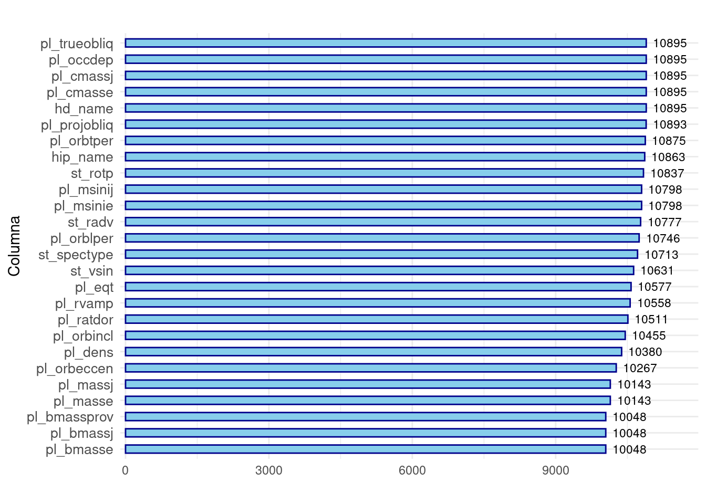

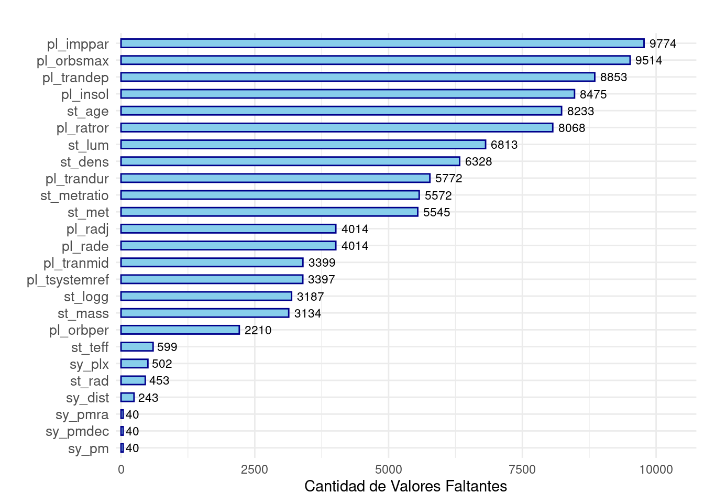

Se detectan grandes cantidades valores faltantes en varias columnas del dataset, probablemente debido a la falta de estimaciones o mediciones para esos exoplanetas. Según los prefijos de columnas explicados en el detalle del dataset (<https://exoplanetarchive.ipac.caltech.edu/docs/API_PS_columns.html#planetparam>), se pueden identificar las siguientes categorías de variables:

-   `pl_`: Parámetros del planeta.
-   `st_`: Parámetros de la estrella.
-   `sy_`: Parámetros del sistema.

Buena parte de las variables faltantes corresponden a parámetros de los exoplanetas y sistemas, lo que puede dificultar el análisis y la predicción de la habitabilidad de los exoplanetas. Por lo tanto, se procederá a estimar los valores faltantes de aquellos parámetros en los que haya una cantidad suficiente de datos para realizar una estimación precisa.

El propósito de este trabajo es estimar los valores faltantes de los exoplanetas y predecir la habitabilidad de los mismos. Para ello, se utilizarán técnicas de regresión lineal y logística para estimar los valores faltantes y predecir la habitabilidad de los exoplanetas.

Tomando las variables conocida de los exoplanetas (parámetros con prefijo `pl_`), busca aquellas posibles predictoras de las variables faltantes. Por ejemplo para el caso del radio del exoplaneta (`pl_radj` en términos de radios jovianos y `pl_rade` en términos terrestres) con 4014 faltantes, hay suficiente información para estimar el radio del exoplaneta a partir de otras variables conocidas como el periodo orbital en días (`pl_orbper` con 2210 faltantes), el tiempo de conjunción (`pl_tranmid` con 3399 faltantes) o el logaritmo en base 10 de gravedad superficial de la estrella en el centro del sistema planteario (`st_logg` con 3187 faltantes).

Para saber cuál de estas variables es la mejor predictoras de la variable faltante, se utilizará la matriz de correlación para identificar las relaciones entre las variables numéricas del dataset con mayor correlación positiva o negativa con la variable faltante.

## Buscando Correlaciones

Se analiza la correlación entre las variables numéricas del dataset para identificar posibles relaciones entre ellas utilizando los métodos de Pearson (detección de correlaciones lineales).


**Matriz de Correlación 1/3 (Pearson Cuadrante Superior)**

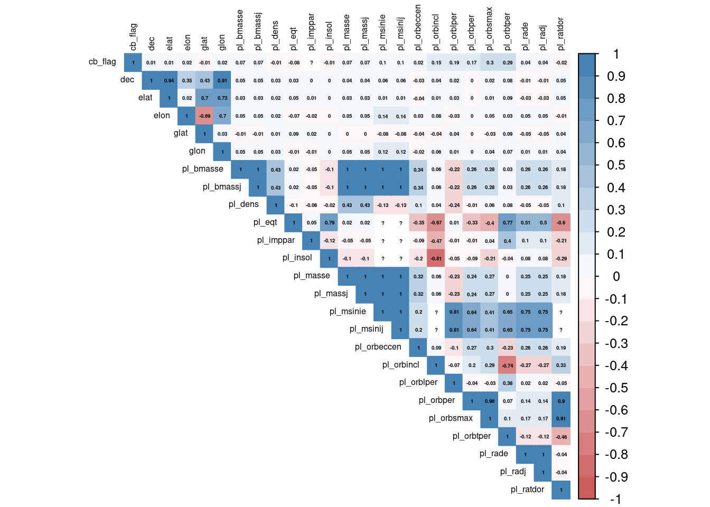

**Matriz de Correlación 2/3 (Pearson Cruce)**

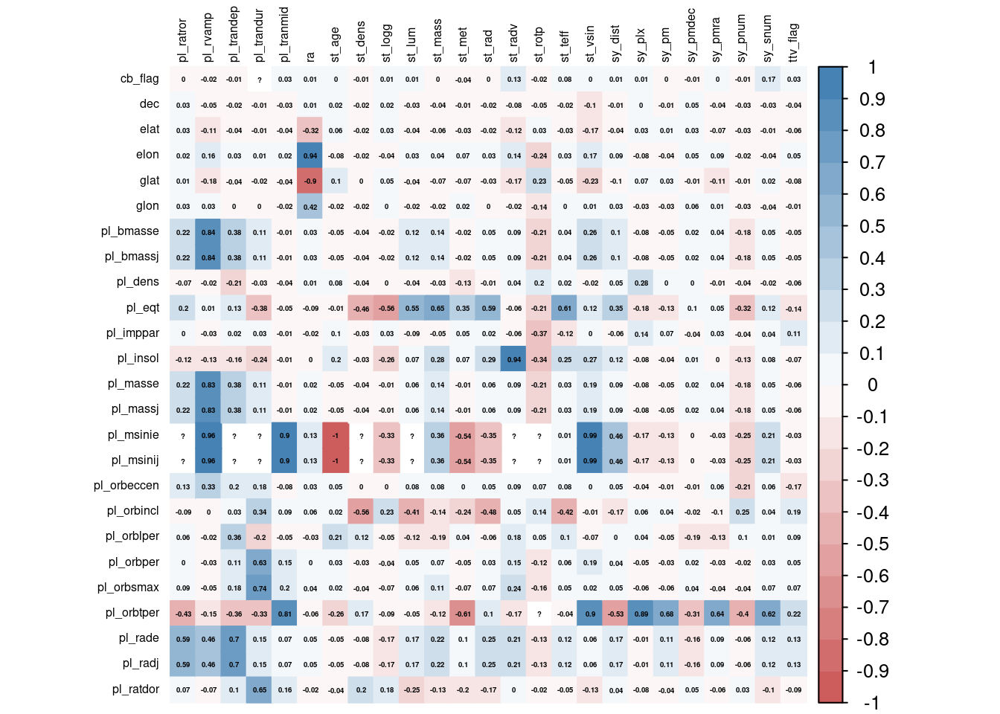

**Matriz de Correlación 3/3 (Pearson Cuadrante Inferior)**

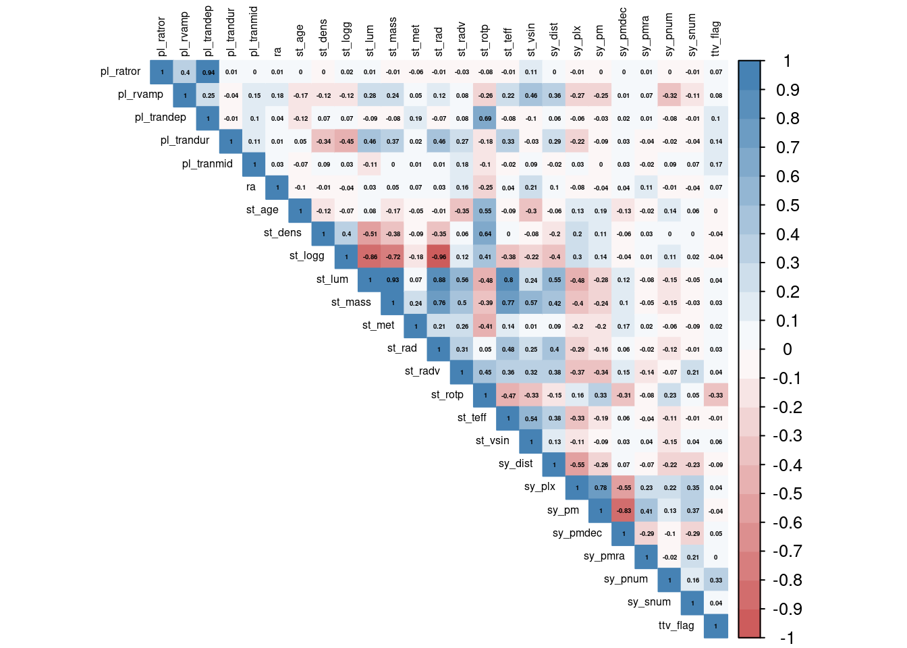

La matriz de correlación muestra las relaciones lineales entre las variables numéricas del dataset. Se observan algunas correlaciones positivas y negativas entre las variables, lo que indica posibles relaciones entre ellas. Por ejemplo el cociente entre el semieje orbital mayor y el periodo orbital (`pl_ratdor`) tiene una correlación positiva con el periodo orbital (`pl_orbper`) y una correlación negativa con la temperatura de equilibrio(`pl_eqt`). Respecto de la variable que se seleccionó como clase en el apartado anterior, el radio del exoplaneta (`pl_radj`) tiene una correlación positiva con la profundidad del tránsito (`pl_trandep`) y una correlación negativa con la gravedad superficial de la estrella (`st_logg`).

# Analisis de Regresión

Para analizar la relación entre las variables conocidas de la estrella del sistema y las caracteristicas de los exoplanetas, se realiza un análisis de regresión lineal. Se seleccionan las caracteristicas conocidas del sistema planetarios como variables independientes.

## Regresión Lineal Univariada

Las variablies de características de los sistemas exoplanetarios tales como periodo orbital, radio planetario, temperatura de la estrella central del sistema y masa del planeta pueden inferirse indirectamente a partir de otras variables como excentricidad orbital, distancia a la estrella, caracteristicas de la estrella y otras. Se explorar un análisis de regresión lineal univariada con varias variables independientes evaluando la capacidad de predicción de cada modelo planteado.

Se realiza un análisis de regresión lineal univariada para predecir el radio del exoplaneta (`pl_radj`) consecutivamente a partir de la profundidad del tránsito (`pl_trandep`), el cociente del semieje orbital mayor sobre el radio estelar (`pl_ratdor`), la amplitud de la velocidad radial (`pl_rvamp`) y el radio de la estrella(`st_rad`). Para cada variable independiente, se ajusta un modelo de regresión lineal con la variable dependiente (`pl_radj`) y se evalúa la capacidad predictiva de cada modelo.


``` r
# Regresion de pl_radj con pl_trandep
model_pl_trandep <- lm(pl_radj ~ pl_trandep, data = kepler_data_num)

model_pl_trandep_summary <- summary(model_pl_trandep)

model_pl_trandep_summary
```

```
## 
## Call:
## lm(formula = pl_radj ~ pl_trandep, data = kepler_data_num)
## 
## Residuals:
##      Min       1Q   Median       3Q      Max 
## -1.13498 -0.14566 -0.06193  0.06415  1.51483 
## 
## Coefficients:
##             Estimate Std. Error t value            Pr(>|t|)    
## (Intercept)  0.24723    0.02641    9.36 <0.0000000000000002 ***
## pl_trandep   0.57670    0.04971   11.60 <0.0000000000000002 ***
## ---
## Signif. codes:  0 '***' 0.001 '**' 0.01 '*' 0.05 '.' 0.1 ' ' 1
## 
## Residual standard error: 0.2736 on 138 degrees of freedom
##   (10755 observations deleted due to missingness)
## Multiple R-squared:  0.4938,	Adjusted R-squared:  0.4901 
## F-statistic: 134.6 on 1 and 138 DF,  p-value: < 0.00000000000000022
```


``` r
# Scatter plot de pl_radj vs pl_trandep con la recta de regresión en rojo
# y los margenes de confianza en gris
ggplot(kepler_data_num, aes(x = pl_trandep, y = pl_radj)) +
  geom_point(color = "steelblue") +
  geom_smooth(method = "lm", color = "red", fill = "grey", alpha = 0.2) +
  labs(title = "Regresión Lineal: Radio del Exoplaneta vs Profundidad del Tránsito",
       x = "Profundidad del Tránsito (%)",
       y = "Radio del Exoplaneta (Júpiter)") +
  theme_minimal()
```

```
## `geom_smooth()` using formula = 'y ~ x'
```

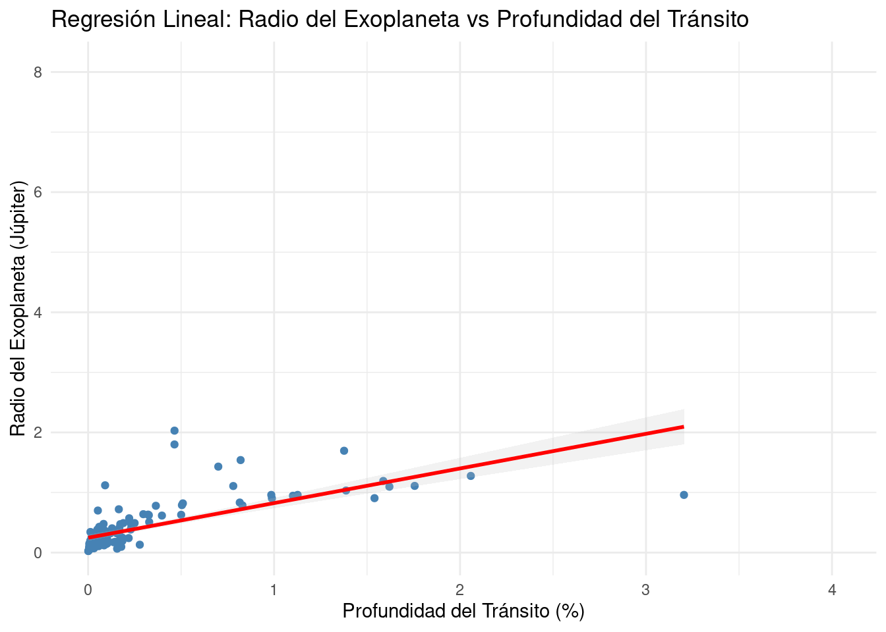


``` r
# Obtener los residuos y valores ajustados
res_pl_trandep <- residuals(model_pl_trandep)

# Estimar los valores ajustados
fit_val_pl_trandep <- fitted(model_pl_trandep)

# Crear un data frame con los residuos y valores ajustados
res_pl_trandep_df <- data.frame(
  Residuals = res_pl_trandep,
  Fitted_Values = fit_val_pl_trandep
)

# Scatter plot de residuos vs valores ajustados
ggplot(res_pl_trandep_df, aes(x = Fitted_Values, y = Residuals)) +
  geom_point(color = "steelblue") +
  geom_hline(yintercept = 0, color = "red", linetype = "dashed") +
  labs(title = "Residuos vs Valores Ajustados",
       x = "Valores Ajustados",
       y = "Residuos") +
  theme_minimal()
```

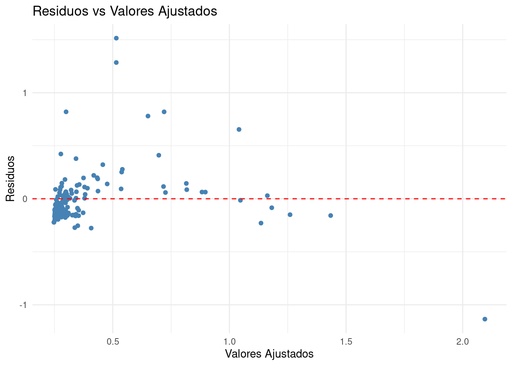


``` r
# Crear un gráfico Q-Q de los residuos
qqnorm(res_pl_trandep, main = "Gráfico Q-Q de los Residuos")
```

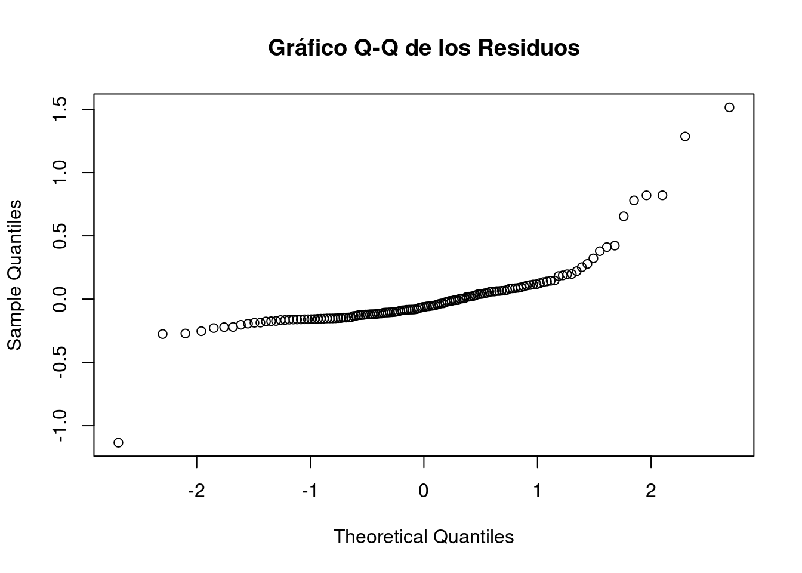


``` r
# Prueba de normalidad de Shapiro-Wilk
shapiro_test_pl_trandep <- shapiro.test(res_pl_trandep)

shapiro_test_pl_trandep
```

```
## 
## 	Shapiro-Wilk normality test
## 
## data:  res_pl_trandep
## W = 0.71231, p-value = 0.000000000000003168
```


``` r
# Prueba de homocedasticidad de Breusch-Pagan
library(lmtest)
```

```
## Loading required package: zoo
```

```
## 
## Attaching package: 'zoo'
```

```
## The following objects are masked from 'package:base':
## 
##     as.Date, as.Date.numeric
```

``` r
# Prueba de Breusch-Pagan
bp_test_pl_trandep <- bptest(model_pl_trandep)

bp_test_pl_trandep
```

```
## 
## 	studentized Breusch-Pagan test
## 
## data:  model_pl_trandep
## BP = 13.983, df = 1, p-value = 0.0001844
```

[Analisis sobre los resultados obtenidos]


``` r
# Regresion del radio del exploplaneta (pl_radj) 
# usando el cociente del semieje orbital mayor sobre 
# el radio estelar (pl_ratdor) como predictor
model_pl_ratdor <- lm(pl_radj ~ pl_ratdor, data = kepler_data_num)

model_pl_ratdor_summary <- summary(model_pl_ratdor)

model_pl_ratdor_summary
```

```
## 
## Call:
## lm(formula = pl_radj ~ pl_ratdor, data = kepler_data_num)
## 
## Residuals:
##     Min      1Q  Median      3Q     Max 
## -0.4686 -0.3530 -0.2622  0.4067  1.5289 
## 
## Coefficients:
##               Estimate Std. Error t value            Pr(>|t|)    
## (Intercept)  0.5023413  0.0310384  16.185 <0.0000000000000002 ***
## pl_ratdor   -0.0002710  0.0003644  -0.744               0.458    
## ---
## Signif. codes:  0 '***' 0.001 '**' 0.01 '*' 0.05 '.' 0.1 ' ' 1
## 
## Residual standard error: 0.4794 on 353 degrees of freedom
##   (10540 observations deleted due to missingness)
## Multiple R-squared:  0.001565,	Adjusted R-squared:  -0.001264 
## F-statistic: 0.5532 on 1 and 353 DF,  p-value: 0.4575
```


``` r
# Scatter plot de pl_radj vs pl_ratdor con la recta de regresión en rojo
# y los margenes de confianza en gris
ggplot(kepler_data_num, aes(x = pl_ratdor, y = pl_radj)) +
  geom_point(color = "steelblue") +
  geom_smooth(method = "lm", color = "indianred", fill = "grey", alpha = 0.2) +
  labs(title = "Regresión Lineal: Radio del Exoplaneta vs Cociente Semieje Orbital Mayor sobre Radio Estelar",
       x = "Cociente Semieje Orbital Mayor sobre Radio Estelar",
       y = "Radio del Exoplaneta (Júpiter)") +
  theme_minimal()
```

```
## `geom_smooth()` using formula = 'y ~ x'
```

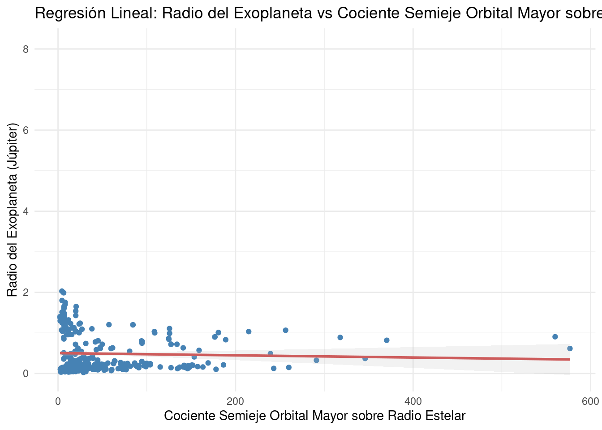


``` r
# Obtener los residuos y valores ajustados
res_pl_ratdor <- residuals(model_pl_ratdor)

# Calcular los valores ajustados
fit_val_pl_ratdor <- fitted(model_pl_ratdor)

# Crear un data frame con los residuos y valores ajustados
res_pl_ratdor_df <- data.frame(
  Residuals = res_pl_ratdor,
  Fitted_Values = fit_val_pl_ratdor
)

# Scatter plot de residuos vs valores ajustados
ggplot(res_pl_ratdor_df, aes(x = Fitted_Values, y = Residuals)) +
  geom_point(color = "steelblue") +
  geom_hline(yintercept = 0, color = "red", linetype = "dashed") +
  labs(title = "Residuos vs Valores Ajustados",
       x = "Valores Ajustados",
       y = "Residuos") +
  theme_minimal()
```

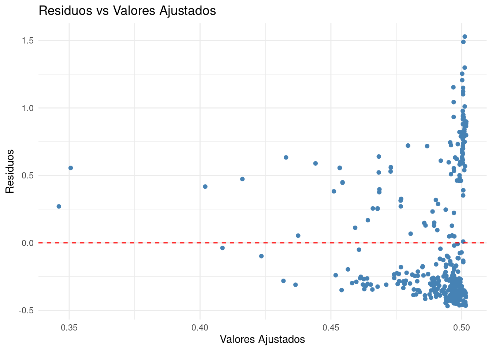


``` r
# Crear un gráfico Q-Q de los residuos
qqnorm(res_pl_ratdor, main = "Gráfico Q-Q de los Residuos")
```

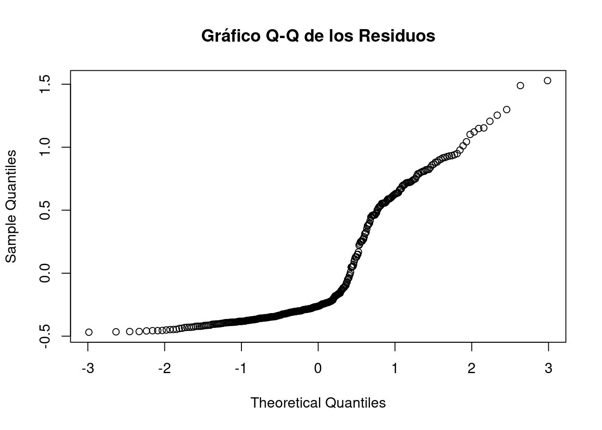


``` r
# Prueba de normalidad de Shapiro-Wilk
shapiro_test_ratdor <- shapiro.test(res_pl_ratdor)

shapiro_test_ratdor
```

```
## 
## 	Shapiro-Wilk normality test
## 
## data:  res_pl_ratdor
## W = 0.80544, p-value < 0.00000000000000022
```


``` r
# Prueba de homocedasticidad de Breusch-Pagan
library(lmtest)

# Prueba de Breusch-Pagan
bp_test_ratdor <- bptest(model_pl_ratdor)

bp_test_ratdor
```

```
## 
## 	studentized Breusch-Pagan test
## 
## data:  model_pl_ratdor
## BP = 13.093, df = 1, p-value = 0.0002964
```

[Analisis sobre los resultados obtenidos]


``` r
# Regresion del radio del exoplaneta (pl_radj) 
# utilizando la amplitud de la velocidad radial del planeta (pl_rvamp)
# como predictor
model_pl_rvamp <- lm(pl_radj ~ pl_rvamp, data = kepler_data_num)

model_pl_rvamp_summary <- summary(model_pl_rvamp)

model_pl_rvamp_summary
```

```
## 
## Call:
## lm(formula = pl_radj ~ pl_rvamp, data = kepler_data_num)
## 
## Residuals:
##     Min      1Q  Median      3Q     Max 
## -0.8715 -0.3379 -0.2439  0.3847  1.4324 
## 
## Coefficients:
##              Estimate Std. Error t value            Pr(>|t|)    
## (Intercept) 0.4873466  0.0271911  17.923 <0.0000000000000002 ***
## pl_rvamp    0.0010980  0.0001186   9.261 <0.0000000000000002 ***
## ---
## Signif. codes:  0 '***' 0.001 '**' 0.01 '*' 0.05 '.' 0.1 ' ' 1
## 
## Residual standard error: 0.4524 on 318 degrees of freedom
##   (10575 observations deleted due to missingness)
## Multiple R-squared:  0.2124,	Adjusted R-squared:  0.2099 
## F-statistic: 85.77 on 1 and 318 DF,  p-value: < 0.00000000000000022
```


``` r
# Scatter plot de pl_radj vs pl_rvamp con la recta de regresión en rojo
# y los margenes de confianza en gris
ggplot(kepler_data_num, aes(x = pl_rvamp, y = pl_radj)) +
  geom_point(color = "steelblue") +
  geom_smooth(method = "lm", color = "indianred", fill = "grey", alpha = 0.2) +
  labs(title = "Regresión Lineal: Radio del Exoplaneta vs Ampitud de Velocidad Radial",
       x = "Ampitud de Velocidad Radial",
       y = "Radio del Exoplaneta (Júpiter)") +
  theme_minimal()
```

```
## `geom_smooth()` using formula = 'y ~ x'
```

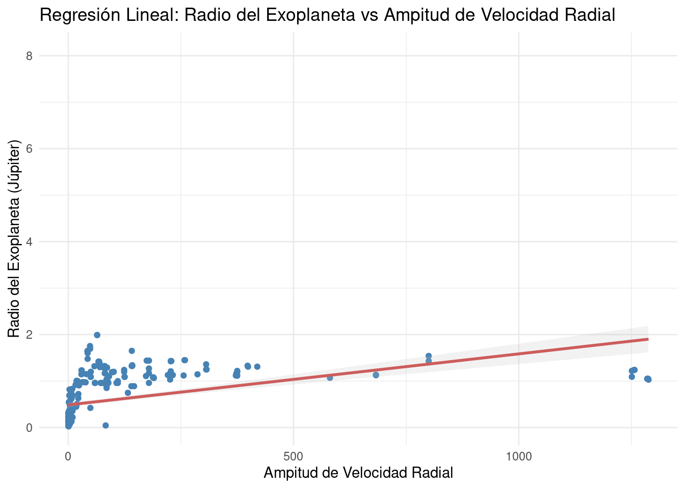


``` r
# Obtener los residuos y valores ajustados
res_pl_rvamp <- residuals(model_pl_rvamp)

# Calcular los valores ajustados
fit_val_pl_rvamp <- fitted(model_pl_rvamp)

# Crear un data frame con los residuos y valores ajustados
res_pl_rvamp_df <- data.frame(
  Residuals = res_pl_rvamp,
  Fitted_Values = fit_val_pl_rvamp
)

# Scatter plot de residuos vs valores ajustados
ggplot(res_pl_rvamp_df, aes(x = Fitted_Values, y = Residuals)) +
  geom_point(color = "steelblue") +
  geom_hline(yintercept = 0, color = "red", linetype = "dashed") +
  labs(title = "Residuos vs Valores Ajustados",
       x = "Valores Ajustados",
       y = "Residuos") +
  theme_minimal()
```

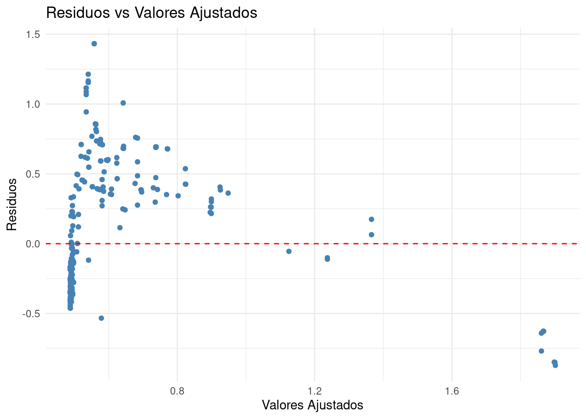


``` r
# Crear un gráfico Q-Q de los residuos
qqnorm(res_pl_rvamp, main = "Gráfico Q-Q de los Residuos")
```

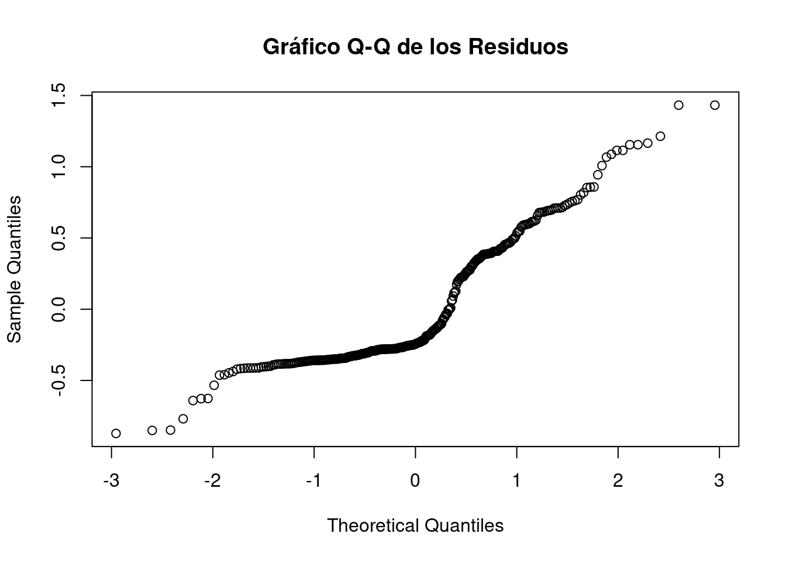


``` r
# Prueba de normalidad de Shapiro-Wilk
shapiro_test_pl_rvamp <- shapiro.test(res_pl_rvamp)

shapiro_test_pl_rvamp
```

```
## 
## 	Shapiro-Wilk normality test
## 
## data:  res_pl_rvamp
## W = 0.87253, p-value = 0.000000000000001297
```


``` r
# Prueba de homocedasticidad de Breusch-Pagan
library(lmtest)

# Prueba de Breusch-Pagan
bp_test_pl_rvamp <- bptest(model_pl_rvamp)

bp_test_pl_rvamp
```

```
## 
## 	studentized Breusch-Pagan test
## 
## data:  model_pl_rvamp
## BP = 12.207, df = 1, p-value = 0.0004762
```

[Analisis sobre los resultados obtenidos]


``` r
# Regresion del radio del exoplaneta (pl_radj) 
# utilizando el radio estelar (st_rad)
# como predictor

model_st_rad <- lm(pl_radj ~ st_rad, data = kepler_data_num)

model_st_rad_summary <- summary(model_st_rad)

model_st_rad_summary
```

```
## 
## Call:
## lm(formula = pl_radj ~ st_rad, data = kepler_data_num)
## 
## Residuals:
##     Min      1Q  Median      3Q     Max 
## -0.4292 -0.1150 -0.0508  0.0124  7.8799 
## 
## Coefficients:
##             Estimate Std. Error t value            Pr(>|t|)    
## (Intercept) 0.083593   0.009320   8.969 <0.0000000000000002 ***
## st_rad      0.173161   0.008323  20.805 <0.0000000000000002 ***
## ---
## Signif. codes:  0 '***' 0.001 '**' 0.01 '*' 0.05 '.' 0.1 ' ' 1
## 
## Residual standard error: 0.2977 on 6669 degrees of freedom
##   (4224 observations deleted due to missingness)
## Multiple R-squared:  0.06095,	Adjusted R-squared:  0.06081 
## F-statistic: 432.8 on 1 and 6669 DF,  p-value: < 0.00000000000000022
```


``` r
# Scatter plot de pl_radj vs st_rad con la recta de regresión en rojo
# y los margenes de confianza en gris
ggplot(kepler_data_num, aes(x = st_rad, y = pl_radj)) +
  geom_point(color = "steelblue") +
  geom_smooth(method = "lm", color = "indianred", fill = "grey", alpha = 0.2) +
  labs(title = "Regresión Lineal: Radio del Exoplaneta vs Radio de la Estrella",
       x = "Radio de la Estrella (Radios Solares)",
       y = "Radio del Exoplaneta (Júpiter)") +
  theme_minimal()
```

```
## `geom_smooth()` using formula = 'y ~ x'
```

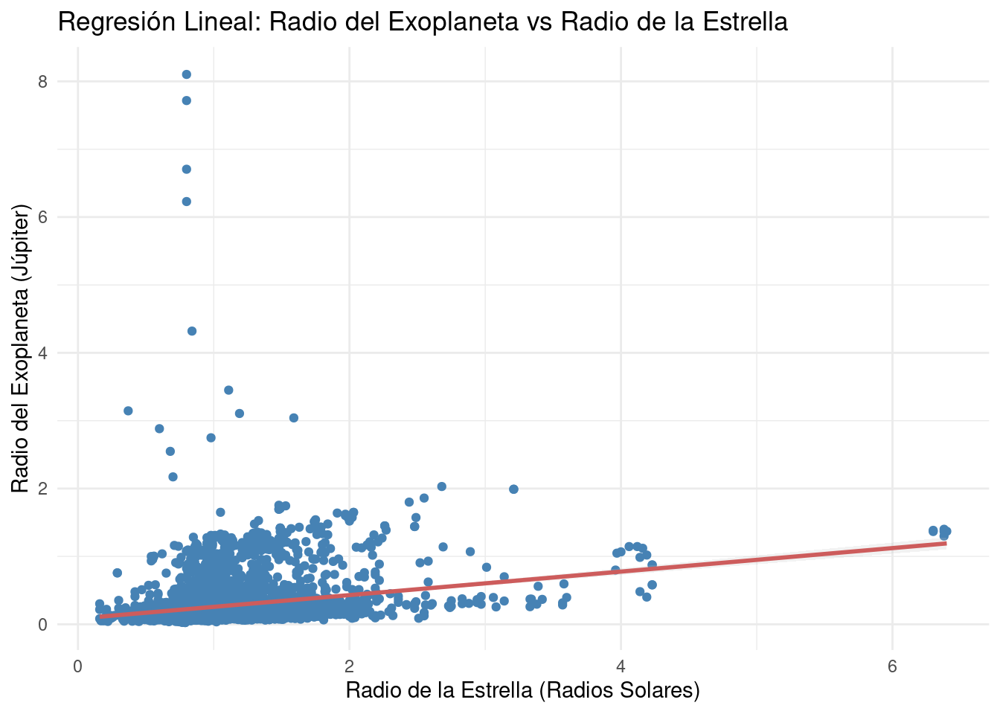


``` r
# Obtener los residuos y valores ajustados
res_st_rad <- residuals(model_st_rad)

# Calcular los valores ajustados
fit_val_st_rad <- fitted(model_st_rad)

# Crear un data frame con los residuos y valores ajustados
res_st_rad_df <- data.frame(
  Residuals = res_st_rad,
  Fitted_Values = fit_val_st_rad
)

# Scatter plot de residuos vs valores ajustados
ggplot(res_st_rad_df, aes(x = Fitted_Values, y = Residuals)) +
  geom_point(color = "steelblue") +
  geom_hline(yintercept = 0, color = "red", linetype = "dashed") +
  labs(title = "Residuos vs Valores Ajustados",
       x = "Valores Ajustados",
       y = "Residuos") +
  theme_minimal()
```

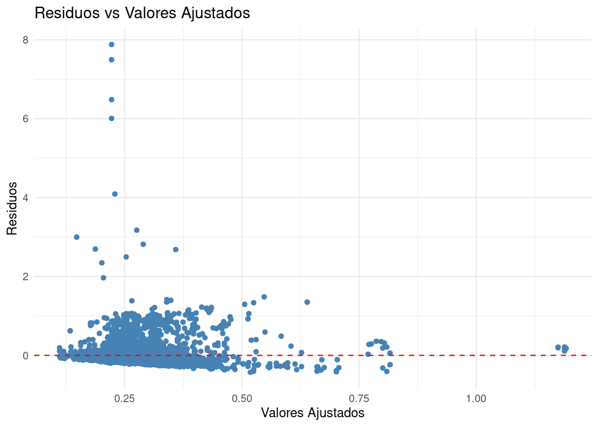


``` r
# Crear un gráfico Q-Q de los residuos

qqnorm(res_st_rad, main = "Gráfico Q-Q de los Residuos")
```


``` r
length(res_st_rad)
```

```
## [1] 6671
```

``` r
# Dado que el test de Shapiro-Wilk funciona con 
# entre 3 y 5000 valores se toman 5000 valores 
# al azar de res_st_rad
res_st_rad <- sample(res_st_rad, 5000)

# Prueba de normalidad de Shapiro-Wilk
shapiro_test_st_rad <- shapiro.test(res_st_rad)

shapiro_test_st_rad
```

```
## 
## 	Shapiro-Wilk normality test
## 
## data:  res_st_rad
## W = 0.46452, p-value < 0.00000000000000022
```


``` r
# Prueba de homocedasticidad de Breusch-Pagan
library(lmtest)

# Prueba de Breusch-Pagan
bp_test_st_rad <- bptest(model_st_rad)

bp_test_st_rad
```

```
## 
## 	studentized Breusch-Pagan test
## 
## data:  model_st_rad
## BP = 1.0599, df = 1, p-value = 0.3032
```

## Regresión Lineal Multivariada

Se realiza un análisis de regresión lineal multivariada para predecir el radio del exoplaneta (`pl_radj`) simultaneamente a partir de la profundidad del tránsito (`pl_trandep`), el cociente del semieje orbital mayor sobre el radio estelar (`pl_ratdor`), la amplitud de la velocidad radial (`pl_rvamp`) y el radio de la estrella(`st_rad`).


``` r
# Regresion de pl_radj con pl_trandep, pl_ratdor, pl_rvamp y st_rad
model_multivar <- lm(pl_radj ~ pl_trandep + pl_ratdor + pl_rvamp + st_rad, data = kepler_data_num)

model_multivar_summary <- summary(model_multivar)

model_multivar_summary
```

```
## 
## Call:
## lm(formula = pl_radj ~ pl_trandep + pl_ratdor + pl_rvamp + st_rad, 
##     data = kepler_data_num)
## 
## Residuals:
##      Min       1Q   Median       3Q      Max 
## -0.43008 -0.11184 -0.06518  0.12101  0.51401 
## 
## Coefficients:
##              Estimate Std. Error t value  Pr(>|t|)    
## (Intercept) 0.0224164  0.1159321   0.193  0.848452    
## pl_trandep  0.3456980  0.0711598   4.858 0.0000743 ***
## pl_ratdor   0.0011662  0.0005050   2.309  0.030705 *  
## pl_rvamp    0.0012304  0.0003173   3.878  0.000811 ***
## st_rad      0.2042422  0.0764570   2.671  0.013946 *  
## ---
## Signif. codes:  0 '***' 0.001 '**' 0.01 '*' 0.05 '.' 0.1 ' ' 1
## 
## Residual standard error: 0.2242 on 22 degrees of freedom
##   (10868 observations deleted due to missingness)
## Multiple R-squared:  0.7947,	Adjusted R-squared:  0.7573 
## F-statistic: 21.28 on 4 and 22 DF,  p-value: 0.0000002667
```


``` r
# Obtener los residuos y valores ajustados
res_multivar <- residuals(model_multivar)

# Calcular los valores ajustados
fit_val_multivar <- fitted(model_multivar)

# Crear un data frame con los residuos y valores ajustados
res_multivar_df <- data.frame(
  Residuals = res_multivar,
  Fitted_Values = fit_val_multivar
)

# Scatter plot de residuos vs valores ajustados
ggplot(res_multivar_df, aes(x = Fitted_Values, y = Residuals)) +
  geom_point(color = "steelblue") +
  geom_hline(yintercept = 0, color = "red", linetype = "dashed") +
  labs(title = "Residuos vs Valores Ajustados",
       x = "Valores Ajustados",
       y = "Residuos") +
  theme_minimal()
```

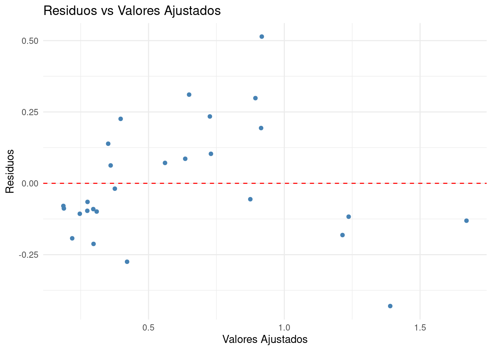


``` r
# Crear un gráfico Q-Q de los residuos
qqnorm(res_multivar, main = "Gráfico Q-Q de los Residuos")
```

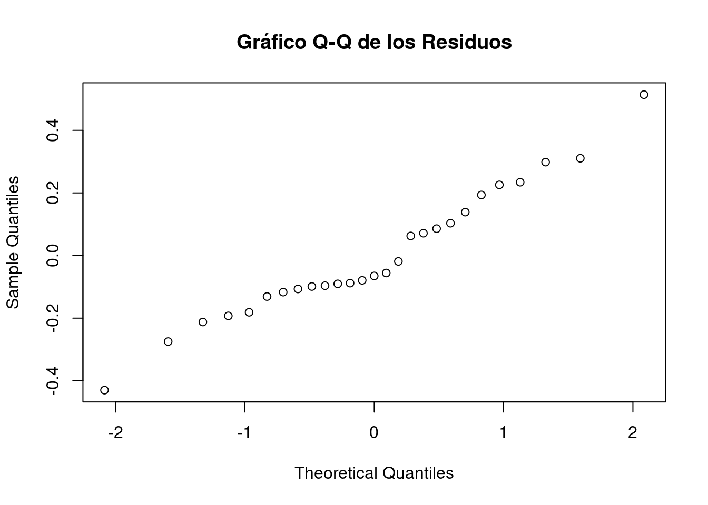


``` r
# Prueba de normalidad de Shapiro-Wilk
shapiro_test_multivar <- shapiro.test(res_multivar)

shapiro_test_multivar
```

```
## 
## 	Shapiro-Wilk normality test
## 
## data:  res_multivar
## W = 0.96694, p-value = 0.5234
```


``` r
# Prueba de homocedasticidad de Breusch-Pagan
library(lmtest)

# Prueba de Breusch-Pagan
bp_test_multivar <- bptest(model_multivar)

bp_test_multivar
```

```
## 
## 	studentized Breusch-Pagan test
## 
## data:  model_multivar
## BP = 12.121, df = 4, p-value = 0.01647
```

## Regresión Logística

Para predecir la habitabilidad de los exoplanetas, se realiza un análisis de regresión logística utilizando las variables conocidas de los exoplanetas y las estrellas del sistema. Se seleccionan las variables conocidas de los exoplanetas y las estrellas como variables independientes y la habitabilidad como variable dependiente.

Existen varios indicadores de habitabilidad de los exoplanetas, como la temperatura de equilibrio (`pl_eqt`), la insolación (`pl_insol`), la distancia orbital semieje mayor (`pl_orbsmax`), la temperatura efectiva de la estrella (`st_teff`), la masa de la estrella (`st_mass`), la luminosidad de la estrella (`st_lum`), la gravedad superficial de la estrella (`st_logg`) y la edad de la estrella (`st_age`). Se seleccionan estas variables como posibles predictores de la habitabilidad de los exoplanetas.

La determinación de la habitabilidad de un exoplaneta es un tema complejo y multifactorial que depende de varios indicadores físicos y químicos. Si bien no existe una fórmula única universalmente aceptada para calcular la "habitabilidad", se pueden combinar los indicadores antes mencionados para aproximar el potencial de habitabilidad de un exoplaneta. Una de las aproximaciones más comunes es usar una combinación ponderada de las condiciones adecuadas para la presencia de agua líquida, ya que esta es fundamental para la vida tal como la conocemos.

Así con los indicadores seleccionados definimos un Índice de Habitabilidad Planetaria (PHI - Planetary Habitability Index) como una función normalizada que combine los indicadores clave:

$$
\text{PHI} = w_1 \cdot f_1(\text{pl_eqt}) + w_2 \cdot f_2(\text{pl_insol}) + w_3 \cdot f_3(\text{pl_orbsmax}) + w_4 \cdot f_{\text{estelar}} 
$$ Donde:

-   $w_i$ son los pesos normalizados asociados a cada indicador sumando 1.
-   $f_i(x)$ son funciones de transformación o normalización que convierten las medidas en valores entre 0 y 1, según el rango de habitabilidad conocido.
-   $f_{\text{estelar}}$ es una función que combina las propiedades estelares de la estrella anfitriona y a su vez es la ponderación de los siguientes parámetros estelares:

$$
    f_{\text{estelar}} = w_5 \cdot f_5(\text{st_teff}) + w_6 \cdot f_6(\text{st_mass}) + w_7 \cdot f_7(\text{st_lum}) + w_8 \cdot f_8(\text{st_logg}) + w_9 \cdot f_9(\text{st_age})
    $$

Estas variables se consideran como posibles predictores de la habitabilidad de los exoplanetas cuando están en determinados rangos.

**Temperatura de equilibrio** (`pl_eqt`): Idealmente, debe estar en un rango compatible con agua líquida, aproximadamente entre 0°C y 100°C. Así la normalización resultan en:

$$
f_i(\text{pl_eqt}) = \max\left(0, \min\left(1, \frac{\text{pl_eqt} - T_{\text{min}}}{T_{\text{max}} - T_{\text{min}}}\right)\right)
$$ Donde $T_{\text{min}}$ y $T_{\text{max}}$ son los límites inferiores y superiores. El agua líquida, esencial para la vida, puede existir en un rango de temperaturas superficiales de aproximadamente 273K (0 °C) a 373K (100 °C). Sin embargo, debido a factores atmosféricos y de presión, este rango puede extenderse ligeramente: $T_{\text{min}}=200K$ puede ser el umbral inferior, considerando atmósferas densas como la de Marte y $T_{\text{max}}=400K$ puede considerarse el umbral superior, considerando atmósferas con alta presión como la de Venus.

Según la literatura especializada el peso de la temperatura de equilibrio en el índice de habitabilidad es de $w_1=0.45$ cuando se considera la temperatura de equilibrio como un indicador preponderante de habitabilidad y no se tienen muchos más datos del planeta.

**Insolación** (`pl_insol`): La insolación es la cantidad de energía recibida por el planeta y es un indicador importante de la habitabilidad. La insolación se mide en unidades de flujo de energía recibida por unidad de área y se puede normalizar en un rango de 0 a 1. La insolación ideal para la vida es aquella que permite la presencia de agua líquida en la superficie del planeta (generalmente valores cercanos a la Tierra son ideales). La insolación se puede normalizar considerando que La Tierra tiene una insolación de 1S (donde $S$ es la insolación solar a la distancia de la Tierra) y se puede considerar que la vida puede existir en un rango de insolación de $I_{min}=0.3S$ (aproximadamente el límite interior de la zona habitable para una estrella como el Sol, más allá de este valor el agua podría congelarse) a $I_{max}=1,7S$ (aproximadamente el límite exterior de la zona habitable, más allá de este valor el agua podría evaporarse). Así la normalización resulta en:

$$
f_2(\text{pl_insol}) = \max\left(0, \min\left(1, \frac{\text{pl_insol} - I_{\text{min}}}{I_{\text{max}} - I_{\text{min}}}\right)\right)
$$

La insolación es un factor crítico para mantener agua líquida en la superficie del planeta, pero su impacto depende de otros factores como la atmósfera y el albedo, según la literatura especializada el peso de la insolación en el índice de habitabilidad es de $w_2=0.30$. Es importante destacar que El rango de $I_{min}$ e $I_{max}$ puede variar según la luminosidad de la estrella, ya que la zona habitable cambia en función del tipo estelar por lo que esta estimación sirve para estrellas similares al Sol.

**Distancia orbital semieje mayor** (`pl_orbsmax`): La distancia orbital semieje mayor es un indicador de la zona habitable de un sistema planetario. La distancia orbital semieje mayor se mide en unidades astronómicas (UA) y se puede normalizar en un rango de 0 a 1. La distancia orbital semieje mayor ideal para la vida es aquella que permite la presencia de agua líquida en la superficie del planeta. La distancia orbital semieje mayor se puede normalizar considerando que La Tierra tiene una distancia orbital semieje mayor de 1 UA y se puede considerar que la vida puede existir en un rango de distancias de $D_{\text{min}}=1,05$ UA (aproximadamente el límite interior de la zona habitable para una estrella como el Sol, más allá de este valor el agua podría congelarse) a $D_{\text{max}}=2$ UA (aproximadamente el límite exterior de la zona habitable, más allá de este valor el agua podría evaporarse). Así la normalización resulta en:

$$
f_3(\text{pl_orbsmax}) = \max\left(0, \min\left(1, \frac{\text{pl_orbsmax} - D_{\text{min}}}{D_{\text{max}} - D_{\text{min}}}\right)\right)
$$ En la mayoría de los modelos, el peso para el valor normalizado de `pl_orbsmax` oscila entre 15% y 25%. Esto se debe a que `pl_orbsmax` complementa indicadores más directos como `pl_eqt` (temperatura de equilibrio) y `pl_insol` (insolación). Se tomará un peso de $w_3=0.20$.

**Propiedades estelares** (`st_teff`, `st_mass`, `st_lum`, `st_logg`, `st_age`): Las propiedades estelares son cruciales para determinar la habitabilidad de un exoplaneta. La estabilidad y tipo de estrella son cruciales puesto que estrellas demasiado masivas tienen vidas cortas y no permiten la evolución de la vida compleja mientras que estrellas con alta actividad estelar pueden emitir radiación peligrosa. La normalización de las propiedades estelares se realiza de manera similar a los indicadores planetarios, considerando los rangos de habitabilidad conocidos para estrellas similares al Sol. La normalización de las propiedades estelares (`st_teff`, `st_mass`, `st_lum`, `st_logg`, `st_age`) es crucial para combinarlas en un único valor que refleje su influencia en la habitabilidad. Cada propiedad se normaliza al rango [0, 1], con valores cercanos a 1 representando condiciones ideales para la habitabilidad.

$$
f_{\text{estelar}} = w_5 \cdot f_5(\text{st_teff}) + w_6 \cdot f_6(\text{st_mass}) + w_7 \cdot f_7(\text{st_lum}) + w_8 \cdot f_8(\text{st_logg}) + w_9 \cdot f_9(\text{st_age})
$$

Donde: - f5(x) es la normalización de la temperatura efectiva de la estrella (`st_teff`) con la normalización de la temperatura efectiva de la estrella ideal para la habitabilidad en el rango de 4000K a 6000K. - f6(x) es la normalización de la masa de la estrella (`st_mass`) con la normalización de la masa de la estrella ideal para la habitabilidad en el rango de 0.8 a 1.2 masas solares. - f7(x) es la normalización de la luminosidad de la estrella (`st_lum`) con la normalización de la luminosidad de la estrella ideal para la habitabilidad en el rango de -0.5 (estrella demasiado débil) a 0.5 (estrella con radiación excesiva) veces la luminosidad solar. - f8(x) es la normalización de la gravedad superficial de la estrella (`st_logg`) con la normalización de la gravedad superficial de la estrella ideal para la habitabilidad en el rango de 4.0 (estrella en evolución fuera de la secuencia principal) a 4.5 (condiciones poco comunes para estrellas típicas). - f9(x) es la normalización de la edad de la estrella (`st_age`) con la normalización de la edad de la estrella ideal para la habitabilidad en el rango de 1 a 10 gigaaños.

En la literatura especializada se considera que el peso de las propiedades estelares en el índice de habitabilidad es de $w_4=0.1$.


``` r
# Crear un data frame con las variables seleccionadas
kepler_data_logistic <- kepler_data_num %>%
  select(pl_eqt, pl_insol, pl_orbsmax, st_teff, st_mass, st_lum, st_logg, st_age)

# Normalizar las variables
kepler_data_logistic_normalized <- kepler_data_logistic %>%
  mutate(
    pl_eqt_normalized = pmin(1, pmax(0, (pl_eqt - 200) / (400 - 200))),
    pl_insol_normalized = pmin(1, pmax(0, (pl_insol - 0.3) / (1.7 - 0.3))),
    pl_orbsmax_normalized = pmin(1, pmax(0, (pl_orbsmax - 1.05) / (2 - 1.05))),
    st_teff_normalized = pmin(1, pmax(0, (st_teff - 4000) / (6000 - 4000))),
    st_mass_normalized = pmin(1, pmax(0, (st_mass - 0.8) / (1.2 - 0.8))),
    st_lum_normalized = pmin(1, pmax(0, (st_lum + 0.5) / 1)),
    st_logg_normalized = pmin(1, pmax(0, (st_logg - 4) / (4.5 - 4))),
    st_age_normalized = pmin(1, pmax(0, (st_age - 1) / (10 - 1)))
  )

# Calcular el índice de habitabilidad planetaria (PHI)
kepler_data_logistic_normalized <- kepler_data_logistic_normalized %>%
  mutate(
    phi = 0.45 * pl_eqt_normalized + 0.30 * pl_insol_normalized + 0.20 * pl_orbsmax_normalized +
      0.1 * (0.45 * st_teff_normalized + 0.30 * st_mass_normalized + 0.20 * st_lum_normalized + 0.15 * st_logg_normalized + 0.10 * st_age_normalized)
  )

# Crear un data frame con las variables normalizadas y el índice de habitabilidad
#kepler_data_logistic_normalized <- kepler_data_logistic_normalized %>%
#  select(pl_eqt_normalized, pl_insol_normalized, pl_orbsmax_normalized, st_teff_normalized, st_mass_normalized, st_lum_normalized, st_logg_normalized, st_age_normalized, phi)


# Crear un modelo de regresión logística
model_logistic <- glm(phi ~ ., data = kepler_data_logistic_normalized, family = binomial)
```

```
## Warning in eval(family$initialize): non-integer #successes in a binomial glm!
```

``` r
model_logistic_summary <- summary(model_logistic)

model_logistic_summary
```

```
## 
## Call:
## glm(formula = phi ~ ., family = binomial, data = kepler_data_logistic_normalized)
## 
## Coefficients: (1 not defined because of singularities)
##                          Estimate  Std. Error z value Pr(>|z|)
## (Intercept)             0.0308563 243.2929697   0.000    1.000
## pl_eqt                 -0.0002647   0.0102833  -0.026    0.979
## pl_insol                0.0007840   0.0290636   0.027    0.978
## pl_orbsmax             -0.1742710   5.2207558  -0.033    0.973
## st_teff                 0.0004804   0.0154253   0.031    0.975
## st_mass                -0.9779453  58.6518781  -0.017    0.987
## st_lum                 -0.2154136  35.8169385  -0.006    0.995
## st_logg                -0.7742803  58.9795992  -0.013    0.990
## st_age                  0.0019258   0.3118849   0.006    0.995
## pl_eqt_normalized       2.0264247   7.3022131   0.278    0.781
## pl_insol_normalized     1.3845435   4.5438237   0.305    0.761
## pl_orbsmax_normalized   1.1307044   6.5932578   0.171    0.864
## st_teff_normalized     -0.0503025  17.3499673  -0.003    0.998
## st_mass_normalized      0.6459251  21.1464106   0.031    0.976
## st_lum_normalized      -0.5965689  19.3112275  -0.031    0.975
## st_logg_normalized     -0.0793174  13.6523723  -0.006    0.995
## st_age_normalized              NA          NA      NA       NA
## 
## (Dispersion parameter for binomial family taken to be 1)
## 
##     Null deviance: 7.912310  on 34  degrees of freedom
## Residual deviance: 0.061764  on 19  degrees of freedom
##   (10860 observations deleted due to missingness)
## AIC: 56.753
## 
## Number of Fisher Scoring iterations: 4
```
